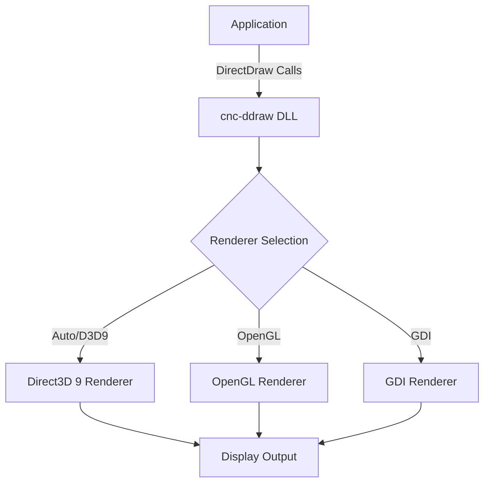
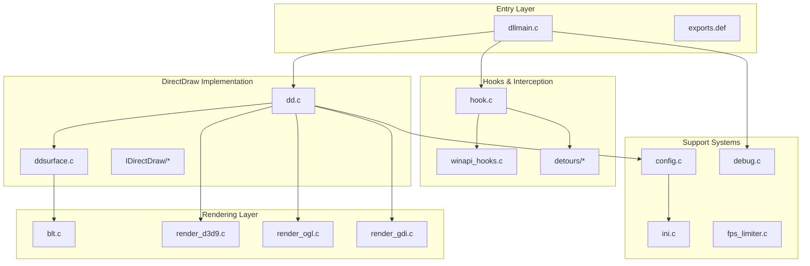
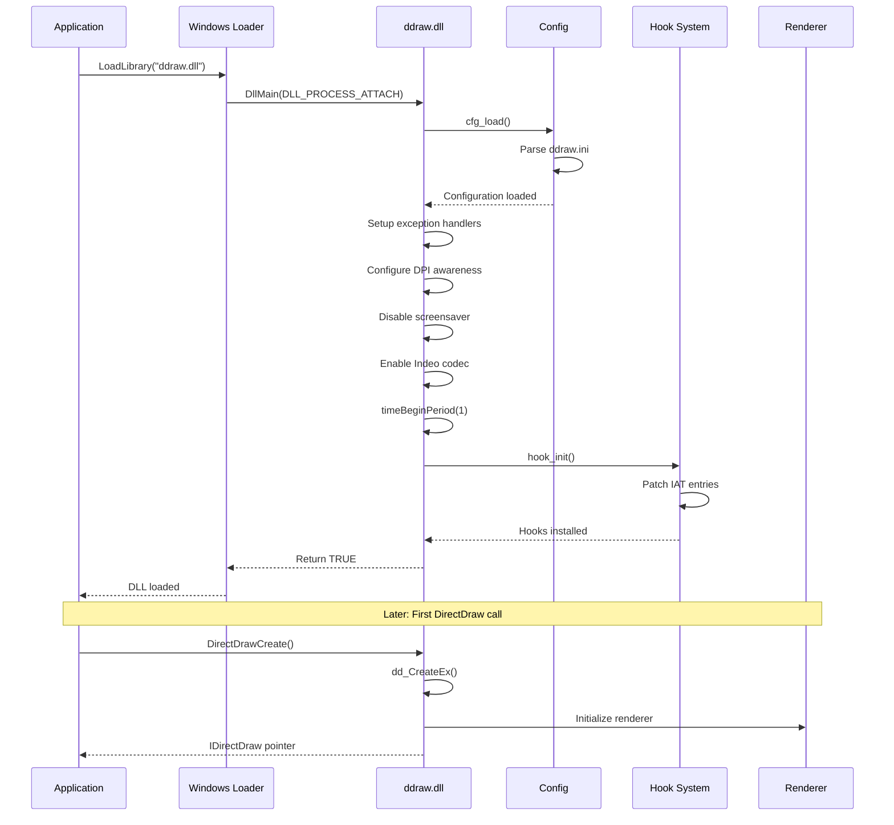
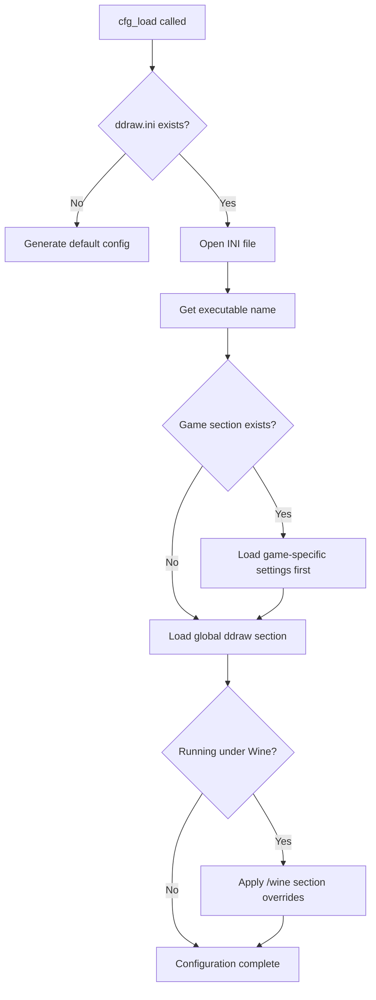
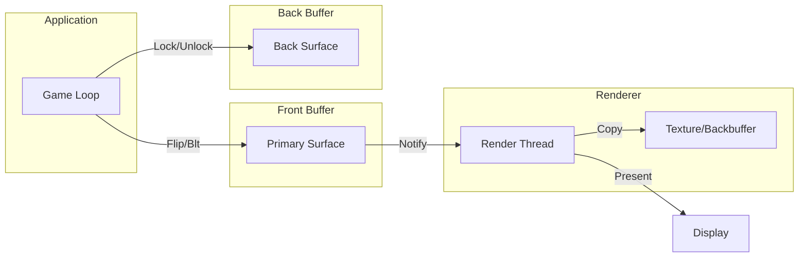

# Reference Analysis: cnc-ddraw Upstream Project

**Document ID:** REF-001
**Version:** 1.0
**Date:** 2026-02-05
**Author:** legacy-ddraw-compat Project Team

---

## 1. Executive Summary

This document provides a comprehensive technical analysis of the **cnc-ddraw** project (https://github.com/FunkyFr3sh/cnc-ddraw), an open-source DirectDraw compatibility layer. The analysis serves as a reference for developing the **legacy-ddraw-compat** project, identifying architectural patterns, feature capabilities, and potential code segments suitable for controlled reuse under the MIT license.

---

## 2. Project Overview

### 2.1 Purpose

cnc-ddraw is a drop-in replacement DLL (`ddraw.dll`) that intercepts legacy DirectDraw API calls and translates them to modern rendering backends (GDI, OpenGL, Direct3D 9). It enables legacy 2D games—particularly Command & Conquer series titles—to run on modern Windows systems (Windows ME through Windows 11) and Wine environments.

### 2.2 License

| Attribute | Value |
|-----------|-------|
| License Type | MIT License |
| SPDX Identifier | MIT |
| Permissions | Commercial use, modification, distribution, private use |
| Conditions | License and copyright notice must be included |
| Limitations | No liability, no warranty |

**License Compliance Note:** Any code reused from cnc-ddraw must include the original copyright notice and MIT license text.

### 2.3 Repository Statistics

| Metric | Value |
|--------|-------|
| Primary Language | C (with C++ components) |
| Source Files | ~90+ |
| Lines of Code | ~50,000+ (estimated) |
| Build System | Visual Studio / Makefile |
| Target Platforms | x86, x64 |

---

## 3. Feature Inventory

### 3.1 Core Features

| Feature ID | Feature Name | Description |
|------------|--------------|-------------|
| F-001 | DirectDraw API Emulation | Full IDirectDraw/IDirectDraw2/IDirectDraw4/IDirectDraw7 interface implementation |
| F-002 | Multi-Renderer Support | GDI, OpenGL, Direct3D 9 backends with automatic selection |
| F-003 | Display Mode Emulation | Fake fullscreen, borderless windowed, true fullscreen modes |
| F-004 | Resolution Scaling | Automatic upscaling/downscaling with aspect ratio preservation |
| F-005 | Shader Support | Custom shader loading for enhanced visuals |
| F-006 | FPS Limiting | Configurable frame rate limiting with multiple strategies |
| F-007 | VSync Support | Vertical synchronization across all renderers |
| F-008 | Alt+Enter Toggle | Runtime fullscreen/windowed mode switching |
| F-009 | Mouse Sensitivity Scaling | Coordinate transformation for scaled viewports |
| F-010 | Screenshot Capture | In-game screenshot functionality |
| F-011 | Configuration System | INI-based configuration with per-game overrides |
| F-012 | Logging/Diagnostics | Debug logging, crash dumps, performance counters |

### 3.2 Compatibility Features

| Feature ID | Feature Name | Description |
|------------|--------------|-------------|
| C-001 | Game-Specific Hacks | Targeted fixes for known problematic titles |
| C-002 | Wine Support | Compatibility with Wine/Proton environments |
| C-003 | DPI Awareness | Per-monitor DPI scaling support |
| C-004 | Legacy Codec Support | Indeo video codec initialization |
| C-005 | DirectInput Hooking | Input subsystem interception for coordinate scaling |

### 3.3 Renderer Capabilities



| Renderer | Shader Support | Performance | Compatibility |
|----------|---------------|-------------|---------------|
| Direct3D 9 | Yes | High | Good (requires D3D9) |
| OpenGL | Yes | High | Excellent |
| GDI | No | Low | Maximum |

---

## 4. Module/Component Analysis

### 4.1 High-Level Architecture



### 4.2 Component Inventory

#### 4.2.1 Entry/Hook Layer

| File | Purpose | Lines (est.) | Complexity |
|------|---------|--------------|------------|
| `dllmain.c` | DLL entry point, initialization orchestration | ~200 | Medium |
| `hook.c` | IAT/Detours hooking infrastructure | ~800 | High |
| `winapi_hooks.c` | Windows API hook implementations | ~2000 | High |
| `detours/*` | Microsoft Detours library (external) | ~5000 | High |

#### 4.2.2 DirectDraw Implementation

| File | Purpose | Lines (est.) | Complexity |
|------|---------|--------------|------------|
| `dd.c` | IDirectDraw interface implementation | ~1500 | High |
| `ddsurface.c` | IDirectDrawSurface implementation | ~2000 | High |
| `ddclipper.c` | IDirectDrawClipper implementation | ~200 | Low |
| `ddpalette.c` | IDirectDrawPalette implementation | ~300 | Medium |
| `IDirectDraw/*.c` | Interface vtable implementations | ~1000 | Medium |

#### 4.2.3 Rendering Layer

| File | Purpose | Lines (est.) | Complexity |
|------|---------|--------------|------------|
| `render_d3d9.c` | Direct3D 9 rendering backend | ~1500 | High |
| `render_ogl.c` | OpenGL rendering backend | ~2000 | High |
| `render_gdi.c` | GDI rendering backend | ~500 | Medium |
| `blt.c` | Bit-block transfer operations | ~800 | Medium |
| `palette.c` | Palette management and conversion | ~400 | Medium |

#### 4.2.4 Configuration & Logging

| File | Purpose | Lines (est.) | Complexity |
|------|---------|--------------|------------|
| `config.c` | Configuration loading and management | ~2000 | Medium |
| `ini.c` | INI file parsing | ~300 | Low |
| `debug.c` | Logging and diagnostics | ~500 | Low |

#### 4.2.5 Utilities

| File | Purpose | Lines (est.) | Complexity |
|------|---------|--------------|------------|
| `utils.c` | General utility functions | ~400 | Low |
| `fps_limiter.c` | Frame rate limiting strategies | ~300 | Medium |
| `screenshot.c` | Screenshot capture | ~200 | Low |
| `crc32.c` | CRC32 checksum calculation | ~100 | Low |

---

## 5. Initialization Flow

### 5.1 DLL Attachment Sequence



### 5.2 Key Initialization Steps

1. **Configuration Loading** (`cfg_load`)
   - Reads `ddraw.ini` from executable directory
   - Applies game-specific overrides based on executable name
   - Sets default values for missing configuration

2. **Exception Handler Setup**
   - Registers vectored exception handler for crash diagnostics
   - Enables minidump generation on unhandled exceptions

3. **DPI Awareness Configuration**
   - Attempts `SetProcessDpiAwarenessContext` (Windows 10+)
   - Falls back to `SetProcessDpiAwareness` (Windows 8.1+)
   - Falls back to manifest-based DPI awareness

4. **System State Modification**
   - Disables screensaver via `SetThreadExecutionState`
   - Sets timer resolution to 1ms via `timeBeginPeriod`

5. **Hook Installation** (`hook_init`)
   - Patches Import Address Table for target modules
   - Optionally uses Detours for inline hooking
   - Installs hooks for ~60+ Windows API functions

---

## 6. Configuration System

### 6.1 Configuration File Structure

```ini
; ddraw.ini structure
[ddraw]
; Global settings
width=0
height=0
fullscreen=false
renderer=auto
maxfps=-1
vsync=false

[game.exe]
; Per-game overrides
maxgameticks=60
singlecpu=true

[ddraw/wine]
; Wine-specific settings
renderer=opengl
```

### 6.2 Configuration Categories

| Category | Settings | Description |
|----------|----------|-------------|
| Display | width, height, fullscreen, windowed, border | Window/display configuration |
| Rendering | renderer, shader, vsync, maxfps | Renderer selection and quality |
| Compatibility | maxgameticks, singlecpu, noactivateapp | Game-specific compatibility |
| Input | adjmouse, devmode, locktopleft | Mouse/input handling |
| Hotkeys | toggle_fullscreen, toggle_maximize | Key bindings |
| Debug | hook, debug | Diagnostic options |

### 6.3 Configuration Parsing Flow



---

## 7. Rendering and Presentation Path

### 7.1 Surface Management



### 7.2 Rendering Thread Model

The rendering operates on a dedicated thread separate from the game's main thread:

1. **Game Thread**: Performs DirectDraw surface operations (Lock, Unlock, Blt, Flip)
2. **Render Thread**: Copies surface data to GPU texture and presents to display
3. **Synchronization**: Uses events/semaphores for thread coordination

### 7.3 Presentation Modes

| Mode | Implementation | Use Case |
|------|----------------|----------|
| Exclusive Fullscreen | `SetCooperativeLevel(DDSCL_EXCLUSIVE)` | Maximum performance, legacy compatibility |
| Borderless Windowed | Maximized borderless window | Modern preference, easy Alt+Tab |
| Windowed | Standard window with borders | Debugging, multi-monitor |

---

## 8. Hooking Mechanisms

### 8.1 Import Address Table (IAT) Patching

Primary hooking method. Modifies function pointers in loaded modules' import tables:

```
1. Enumerate loaded modules
2. For each module's IAT:
   a. Find target function import
   b. VirtualProtect to PAGE_READWRITE
   c. Replace function pointer with hook
   d. Restore memory protection
```

### 8.2 Detours (Optional)

Inline function hooking using Microsoft Detours:

```
1. DetourTransactionBegin()
2. DetourUpdateThread()
3. DetourAttach(&RealFunction, HookFunction)
4. DetourTransactionCommit()
```

### 8.3 Hooked API Categories

| Category | Examples | Purpose |
|----------|----------|---------|
| Cursor | GetCursorPos, SetCursorPos, ClipCursor | Coordinate scaling |
| Window | SetWindowPos, MoveWindow, ShowWindow | Window management |
| Input | GetAsyncKeyState, GetKeyState | Input state |
| Graphics | BitBlt, StretchBlt | GDI interception |
| Library | LoadLibraryA/W | DLL load monitoring |
| DirectInput | DirectInputCreate* | Input device handling |

---

## 9. Logging and Diagnostics

### 9.1 Logging System

| Feature | Implementation |
|---------|----------------|
| Output Format | `[ThreadID] HH:MM:SS.mmm Message` |
| Output Target | File (ddraw.log) |
| Rotation | 3 files, 100MB each |
| Conditional Compilation | `_DEBUG` and `_DEBUG_X` macros |

### 9.2 Diagnostic Capabilities

| Capability | Description |
|------------|-------------|
| Minidump Generation | Creates crash dumps on unhandled exceptions |
| Performance Counters | Frame timing and FPS calculation |
| Flag Dumping | Converts DirectDraw flags to readable strings |
| HRESULT Translation | Maps D3D9 error codes to descriptions |
| System Information | Logs Windows version, Wine detection, module info |

### 9.3 Debug Build Features

- Extended flag dumping for DirectDraw structures
- Verbose API call tracing
- Surface state logging
- Hook installation verification

---

## 10. Key Technical Decisions

### 10.1 Design Choices

| Decision | Rationale | Trade-off |
|----------|-----------|-----------|
| C language (not C++) | Compatibility with older compilers, smaller binary | Limited abstraction |
| Multiple renderers | Maximum compatibility across systems | Code duplication |
| IAT hooking primary | Simple, reliable, no external dependencies | Limited to import calls |
| Global state (`g_ddraw`) | Simple access pattern | Thread safety concerns |
| Dedicated render thread | Decouples game timing from display refresh | Complexity |

### 10.2 Notable Implementation Patterns

1. **Vtable Construction**: Interface vtables built at runtime with function pointers
2. **Reference Counting**: COM-style reference counting for DirectDraw objects
3. **Fallback Chains**: Resolution and renderer selection use cascading fallbacks
4. **Game Detection**: CRC32 checksums and executable names for game identification

---

## 11. Conclusions and Recommendations

### 11.1 Strengths of cnc-ddraw

- Mature, battle-tested codebase
- Comprehensive game compatibility
- Clean separation of rendering backends
- Well-documented configuration options

### 11.2 Areas for Improvement

- Limited unit testing
- Global state management
- Mixed C/C++ codebase
- Monolithic source files (some >2000 lines)

### 11.3 Recommendations for legacy-ddraw-compat

1. **Adopt**: Multi-renderer architecture, INI configuration approach, IAT hooking pattern
2. **Improve**: Modularization, unit test coverage, documentation
3. **Reuse Candidates**: INI parsing, logging utilities, CRC32, basic hook infrastructure
4. **Avoid**: Large monolithic files, global state patterns, game-specific hacks (initially)

---

## Appendix A: File Inventory

| Path | Type | Description |
|------|------|-------------|
| `src/dllmain.c` | Source | DLL entry point |
| `src/dd.c` | Source | IDirectDraw implementation |
| `src/ddsurface.c` | Source | IDirectDrawSurface implementation |
| `src/config.c` | Source | Configuration management |
| `src/hook.c` | Source | Hook infrastructure |
| `src/winapi_hooks.c` | Source | Windows API hooks |
| `src/render_d3d9.c` | Source | D3D9 renderer |
| `src/render_ogl.c` | Source | OpenGL renderer |
| `src/render_gdi.c` | Source | GDI renderer |
| `src/debug.c` | Source | Logging/diagnostics |
| `src/ini.c` | Source | INI parsing |
| `src/blt.c` | Source | Blit operations |
| `inc/ddraw.h` | Header | DirectDraw definitions |
| `inc/config.h` | Header | Configuration structures |

---

## Appendix B: References

1. cnc-ddraw GitHub Repository: https://github.com/FunkyFr3sh/cnc-ddraw
2. Microsoft DirectDraw Documentation (archived)
3. Wine DirectDraw Implementation
4. Microsoft Detours Library

---

*End of Document*
