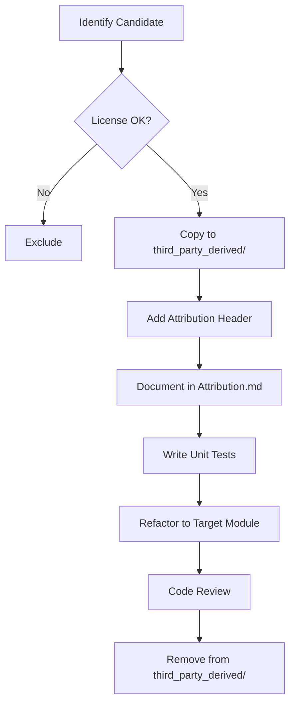

# Code Reuse Plan: cnc-ddraw to legacy-ddraw-compat

**Document ID:** REUSE-001
**Version:** 1.0
**Date:** 2026-02-05
**Author:** legacy-ddraw-compat Project Team

---

## 1. Introduction

### 1.1 Purpose

This document identifies specific code segments from the cnc-ddraw project that are candidates for controlled reuse in the legacy-ddraw-compat project. Each candidate is evaluated for:

- Technical suitability
- License compliance
- Risk assessment
- Required modifications
- Target location in new architecture

### 1.2 Reuse Policy

All reused code must:

1. Be MIT license compatible (cnc-ddraw uses MIT)
2. Include attribution header comments
3. Be documented in `ThirdParty_Attribution.md`
4. Initially placed in `src/third_party_derived/` then refactored
5. Have unit tests added where applicable
6. Be modified to fit the new architecture's coding standards

### 1.3 Attribution Header Template

```cpp
// =============================================================================
// Derived from cnc-ddraw (https://github.com/FunkyFr3sh/cnc-ddraw)
// Original file: <path>
// Commit: <hash>
// License: MIT
//
// Modifications by legacy-ddraw-compat project:
// - <description of changes>
// =============================================================================
```

---

## 2. Reuse Candidates Summary

| ID | Component | Origin File | Risk | Decision |
|----|-----------|-------------|------|----------|
| RC-001 | INI Parser Core | `src/ini.c` | Low | **REUSE** |
| RC-002 | CRC32 Implementation | `src/crc32.c` | Low | **REUSE** |
| RC-003 | Debug Timestamp Formatting | `src/debug.c` | Low | **REUSE** |
| RC-004 | IAT Hook Pattern | `src/hook.c` | Medium | **ADAPT** |
| RC-005 | DirectDraw GUID Definitions | `inc/ddraw.h` | Low | **REFERENCE** |
| RC-006 | Flag-to-String Converters | `src/debug.c` | Low | **REUSE** |
| RC-007 | FPS Limiter Timer Logic | `src/fps_limiter.c` | Medium | **ADAPT** |
| RC-008 | Palette Conversion Math | `src/palette.c` | Medium | **ADAPT** |
| RC-009 | Config Default Patterns | `src/config.c` | Low | **REFERENCE** |
| RC-010 | Detours Library | `src/detours/*` | High | **EXCLUDE** |

---

## 3. Detailed Candidate Analysis

### 3.1 RC-001: INI Parser Core

#### 3.1.1 Overview

| Attribute | Value |
|-----------|-------|
| Origin | `src/ini.c` |
| Estimated Lines | ~300 |
| Dependencies | Standard C library only |
| License | MIT |
| Decision | **REUSE with modifications** |

#### 3.1.2 Rationale

The INI parser implements a minimal, dependency-free parser for Windows INI file format. This is a well-isolated utility with no external dependencies.

#### 3.1.3 Code Segment

```c
// Relevant functions to reuse:
// - ini_open()
// - ini_close()
// - ini_read_string()
// - ini_read_int()
// - ini_read_bool()
```

#### 3.1.4 Risk Assessment

| Risk | Level | Mitigation |
|------|-------|------------|
| Code quality | Low | Well-tested in production use |
| Hidden dependencies | Low | Standalone module |
| Licensing | None | MIT compatible |

#### 3.1.5 Planned Modifications

1. Convert to C++ with RAII patterns (file handle management)
2. Add error codes and exception support
3. Add UTF-8 BOM handling
4. Add unit tests for edge cases
5. Rename functions with `ldc_` prefix (legacy-ddraw-compat)
6. Add const correctness

#### 3.1.6 Target Location

```
src/config/IniParser.cpp
include/config/IniParser.h
tests/unit/IniParserTests.cpp
```

---

### 3.2 RC-002: CRC32 Implementation

#### 3.2.1 Overview

| Attribute | Value |
|-----------|-------|
| Origin | `src/crc32.c` |
| Estimated Lines | ~100 |
| Dependencies | None |
| License | MIT (likely public domain algorithm) |
| Decision | **REUSE** |

#### 3.2.2 Rationale

Standard CRC32 implementation used for game executable identification. The algorithm itself is well-known and the implementation is compact.

#### 3.2.3 Risk Assessment

| Risk | Level | Mitigation |
|------|-------|------------|
| Correctness | Low | Standard algorithm, verifiable |
| Performance | Low | Lookup table implementation |
| Licensing | None | Algorithm is public domain |

#### 3.2.4 Planned Modifications

1. Wrap in C++ class with streaming interface
2. Add compile-time table generation (constexpr)
3. Add unit tests with known test vectors
4. Document algorithm variant (ISO 3309 polynomial)

#### 3.2.5 Target Location

```
src/diagnostics/Crc32.cpp
include/diagnostics/Crc32.h
tests/unit/Crc32Tests.cpp
```

---

### 3.3 RC-003: Debug Timestamp Formatting

#### 3.3.1 Overview

| Attribute | Value |
|-----------|-------|
| Origin | `src/debug.c` (timestamp formatting) |
| Estimated Lines | ~30 |
| Dependencies | Windows API (GetLocalTime) |
| License | MIT |
| Decision | **REUSE** |

#### 3.3.2 Rationale

The timestamp formatting pattern `[ThreadID] HH:MM:SS.mmm` is a useful logging convention. The implementation is minimal.

#### 3.3.3 Code Pattern

```c
// Pattern to adapt:
void format_timestamp(char* buffer, size_t size) {
    SYSTEMTIME st;
    GetLocalTime(&st);
    sprintf(buffer, "[%lu] %02d:%02d:%02d.%03d ",
            GetCurrentThreadId(),
            st.wHour, st.wMinute, st.wSecond, st.wMilliseconds);
}
```

#### 3.3.4 Planned Modifications

1. Use `std::format` or safe string formatting
2. Make thread ID optional
3. Add ISO 8601 format option
4. Support custom format strings

#### 3.3.5 Target Location

```
src/logging/LogFormatter.cpp
include/logging/LogFormatter.h
```

---

### 3.4 RC-004: IAT Hook Pattern

#### 3.4.1 Overview

| Attribute | Value |
|-----------|-------|
| Origin | `src/hook.c` |
| Estimated Lines | ~200 (core pattern) |
| Dependencies | Windows API |
| License | MIT |
| Decision | **ADAPT** (rewrite inspired by) |

#### 3.4.2 Rationale

IAT (Import Address Table) hooking is a well-established technique. The cnc-ddraw implementation demonstrates the pattern but we will write a cleaner, documented version.

#### 3.4.3 Risk Assessment

| Risk | Level | Mitigation |
|------|-------|------------|
| Complexity | Medium | Thorough documentation and testing |
| Stability | Medium | Extensive testing on multiple Windows versions |
| Security | Medium | Careful memory protection handling |

#### 3.4.4 Planned Approach

**Do not copy directly.** Instead:

1. Study the pattern and Windows PE format documentation
2. Write new implementation with:
   - Clear documentation of PE structures
   - Error handling for each step
   - Support for both x86 and x64
   - Hook verification mechanisms
3. Reference cnc-ddraw as architectural inspiration

#### 3.4.5 Target Location

```
src/hooks/IatHook.cpp
include/hooks/IatHook.h
tests/unit/IatHookTests.cpp
```

---

### 3.5 RC-005: DirectDraw GUID Definitions

#### 3.5.1 Overview

| Attribute | Value |
|-----------|-------|
| Origin | `inc/ddraw.h` |
| Estimated Lines | ~50 (GUID definitions) |
| Dependencies | None |
| License | MIT (but GUIDs are Microsoft-defined) |
| Decision | **REFERENCE** |

#### 3.5.2 Rationale

DirectDraw interface GUIDs are defined by Microsoft and are not copyrightable. We will use Windows SDK definitions where available.

#### 3.5.3 Planned Approach

1. Use `<ddraw.h>` from Windows SDK where possible
2. Define only missing GUIDs with Microsoft documentation reference
3. No direct code copy needed

---

### 3.6 RC-006: Flag-to-String Converters

#### 3.6.1 Overview

| Attribute | Value |
|-----------|-------|
| Origin | `src/debug.c` |
| Estimated Lines | ~200 |
| Dependencies | DirectDraw headers |
| License | MIT |
| Decision | **REUSE with modifications** |

#### 3.6.2 Rationale

Functions that convert DirectDraw flags (DDSD_*, DDSCAPS_*, DDBLT_*) to human-readable strings are useful for debugging. The mapping is deterministic and tedious to recreate.

#### 3.6.3 Code Example

```c
// Pattern:
const char* ddscaps_to_string(DWORD caps) {
    static char buffer[1024];
    buffer[0] = '\0';
    if (caps & DDSCAPS_PRIMARYSURFACE) strcat(buffer, "PRIMARYSURFACE ");
    if (caps & DDSCAPS_BACKBUFFER) strcat(buffer, "BACKBUFFER ");
    // ...
    return buffer;
}
```

#### 3.6.4 Planned Modifications

1. Use thread-safe approach (no static buffers)
2. Return `std::string` instead of C string
3. Use `std::ostringstream` for building
4. Add unit tests
5. Complete flag coverage from Windows SDK

#### 3.6.5 Target Location

```
src/diagnostics/FlagStrings.cpp
include/diagnostics/FlagStrings.h
tests/unit/FlagStringsTests.cpp
```

---

### 3.7 RC-007: FPS Limiter Timer Logic

#### 3.7.1 Overview

| Attribute | Value |
|-----------|-------|
| Origin | `src/fps_limiter.c` |
| Estimated Lines | ~150 |
| Dependencies | Windows multimedia timers |
| License | MIT |
| Decision | **ADAPT** |

#### 3.7.2 Rationale

Frame rate limiting using waitable timers is a specific technique worth understanding. We will study and reimplement with modern C++.

#### 3.7.3 Risk Assessment

| Risk | Level | Mitigation |
|------|-------|------------|
| Timer precision | Medium | Test on various hardware |
| Thread safety | Medium | Proper synchronization |

#### 3.7.4 Planned Approach

1. Study the timing mechanisms used
2. Implement using modern C++ `<chrono>`
3. Support multiple strategies (sleep, waitable timer, spin-wait)
4. Add configurable precision/CPU tradeoff

#### 3.7.5 Target Location

```
src/core/FrameLimiter.cpp
include/core/FrameLimiter.h
tests/unit/FrameLimiterTests.cpp
```

---

### 3.8 RC-008: Palette Conversion Math

#### 3.8.1 Overview

| Attribute | Value |
|-----------|-------|
| Origin | `src/palette.c` |
| Estimated Lines | ~100 |
| Dependencies | None |
| License | MIT |
| Decision | **ADAPT** |

#### 3.8.2 Rationale

8-bit to 32-bit palette conversion is mathematically defined but the lookup table approach is efficient.

#### 3.8.3 Planned Approach

1. Implement standard palette conversion
2. Support multiple source/destination formats
3. SIMD optimization where beneficial
4. Unit tests with known palettes

#### 3.8.5 Target Location

```
src/renderer/PaletteConverter.cpp
include/renderer/PaletteConverter.h
```

---

### 3.9 RC-009: Config Default Patterns

#### 3.9.1 Overview

| Attribute | Value |
|-----------|-------|
| Origin | `src/config.c` |
| Estimated Lines | N/A (patterns only) |
| Dependencies | N/A |
| License | MIT |
| Decision | **REFERENCE** |

#### 3.9.2 Rationale

The configuration structure and default values serve as a reference for what settings are needed. We will not copy code but use as requirements input.

#### 3.9.3 Planned Approach

1. Document configuration options needed
2. Design our own configuration schema
3. Implement with modern C++ (std::optional, strong types)

---

### 3.10 RC-010: Detours Library

#### 3.10.1 Overview

| Attribute | Value |
|-----------|-------|
| Origin | `src/detours/*` |
| Estimated Lines | ~5000 |
| Dependencies | Complex |
| License | MIT (Microsoft Detours) |
| Decision | **EXCLUDE** |

#### 3.10.2 Rationale

The Detours library is a large, complex codebase. For our project:

1. IAT hooking is sufficient for initial release
2. If inline hooking is needed, use official Microsoft Detours NuGet package
3. Reduces maintenance burden

#### 3.10.3 Alternative

Use official Microsoft Detours via NuGet or vcpkg if inline hooking becomes necessary.

---

## 4. Reuse Workflow

### 4.1 Process Diagram



### 4.2 Checklist for Each Reuse

- [ ] License verified (MIT compatible)
- [ ] Code copied to `src/third_party_derived/`
- [ ] Attribution header added to file
- [ ] Entry added to `ThirdParty_Attribution.md`
- [ ] Unit tests written
- [ ] Code refactored to project standards
- [ ] Code moved to final location
- [ ] Original copy removed from `third_party_derived/`
- [ ] Documentation updated

---

## 5. Non-Reuse Items

The following are explicitly **not** being reused:

| Component | Reason |
|-----------|--------|
| Full DirectDraw implementation | Core functionality, will implement fresh |
| Renderer implementations | Will design new architecture |
| Game-specific hacks | Out of scope for initial release |
| Configuration GUI | Out of scope |
| Full hook.c | Will reimplement with documentation |
| winapi_hooks.c | Will selectively implement needed hooks |

---

## 6. License Compliance Summary

### 6.1 MIT License Requirements

The MIT license requires:

1. **Copyright notice preservation** - Done via attribution headers
2. **License text inclusion** - Will include in `LICENSE-THIRD-PARTY.md`

### 6.2 Our Compliance Measures

1. Attribution headers on all derived code
2. `ThirdParty_Attribution.md` ledger
3. `LICENSE-THIRD-PARTY.md` with full MIT text
4. README acknowledgment of cnc-ddraw project

---

## 7. Risk Summary

| Risk Category | Count | Mitigation Strategy |
|---------------|-------|---------------------|
| Low Risk | 5 | Standard code review |
| Medium Risk | 3 | Additional testing, documentation |
| High Risk | 1 | Excluded from reuse |
| Excluded | 1 | N/A |

---

## Appendix A: Attribution Ledger Template

```markdown
# Third-Party Attribution Ledger

## cnc-ddraw (MIT License)

### File: src/config/IniParser.cpp
- **Origin:** src/ini.c
- **Commit:** <hash>
- **License:** MIT
- **Modifications:**
  - Converted to C++
  - Added RAII file handling
  - Added error codes
```

---

## Appendix B: MIT License Text (cnc-ddraw)

```
MIT License

Copyright (c) [year] [copyright holders]

Permission is hereby granted, free of charge, to any person obtaining a copy
of this software and associated documentation files (the "Software"), to deal
in the Software without restriction, including without limitation the rights
to use, copy, modify, merge, publish, distribute, sublicense, and/or sell
copies of the Software, and to permit persons to whom the Software is
furnished to do so, subject to the following conditions:

The above copyright notice and this permission notice shall be included in all
copies or substantial portions of the Software.

THE SOFTWARE IS PROVIDED "AS IS", WITHOUT WARRANTY OF ANY KIND, EXPRESS OR
IMPLIED, INCLUDING BUT NOT LIMITED TO THE WARRANTIES OF MERCHANTABILITY,
FITNESS FOR A PARTICULAR PURPOSE AND NONINFRINGEMENT. IN NO EVENT SHALL THE
AUTHORS OR COPYRIGHT HOLDERS BE LIABLE FOR ANY CLAIM, DAMAGES OR OTHER
LIABILITY, WHETHER IN AN ACTION OF CONTRACT, TORT OR OTHERWISE, ARISING FROM,
OUT OF OR IN CONNECTION WITH THE SOFTWARE OR THE USE OR OTHER DEALINGS IN THE
SOFTWARE.
```

---

*End of Document*
