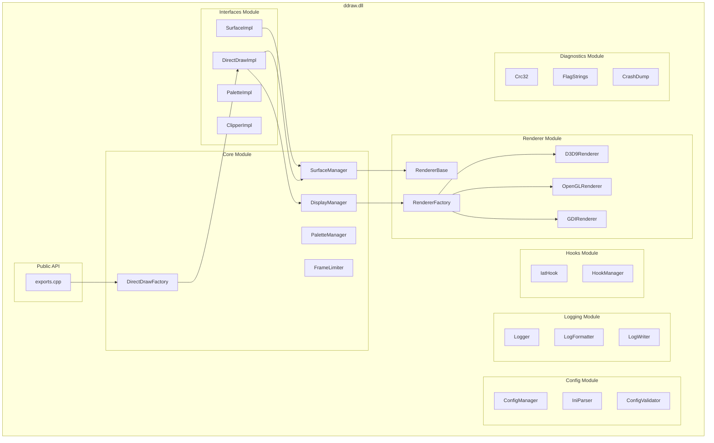

# Software Design Document (SDD)

## legacy-ddraw-compat: DirectDraw Compatibility Layer

**Document ID:** SDD-001
**Version:** 1.0
**Date:** 2026-02-05
**Status:** Approved

---

## Table of Contents

1. [Introduction](#1-introduction)
2. [Architectural Design](#2-architectural-design)
3. [Detailed Component Design](#3-detailed-component-design)
4. [Data Structures](#4-data-structures)
5. [Algorithm Design](#5-algorithm-design)
6. [Interface Design](#6-interface-design)
7. [Error Handling Design](#7-error-handling-design)
8. [Security Considerations](#8-security-considerations)

---

## 1. Introduction

### 1.1 Purpose

This Software Design Document (SDD) provides detailed design specifications for the legacy-ddraw-compat project. It describes the internal architecture, data structures, algorithms, and interfaces at a level sufficient for implementation.

### 1.2 Scope

This document covers:
- Class and module design
- Data structure specifications
- Algorithm descriptions
- Interface contracts
- Error handling mechanisms

### 1.3 Design Goals

| Goal | Description | Priority |
|------|-------------|----------|
| DG-001 | Correctness | DirectDraw API compliance | Critical |
| DG-002 | Performance | Minimal overhead | High |
| DG-003 | Maintainability | Clean, documented code | High |
| DG-004 | Testability | Unit-testable components | Medium |
| DG-005 | Extensibility | Easy to add renderers | Medium |

---

## 2. Architectural Design

### 2.1 Module Decomposition



### 2.2 Dependency Rules

1. **No circular dependencies** between modules
2. **Lower layers** do not depend on higher layers
3. **Support modules** (Config, Logging) have no dependencies on core logic
4. **Interfaces module** depends on Core, not vice versa

### 2.3 Namespace Organization

```cpp
namespace ldc {                     // legacy-ddraw-compat root
    namespace core {                // Core module
        class SurfaceManager;
        class DisplayManager;
        // ...
    }
    namespace interfaces {          // DirectDraw interfaces
        class DirectDrawImpl;
        class SurfaceImpl;
        // ...
    }
    namespace renderer {            // Rendering backends
        class IRenderer;
        class D3D9Renderer;
        // ...
    }
    namespace config {              // Configuration
        class ConfigManager;
        class IniParser;
        // ...
    }
    namespace logging {             // Logging
        class Logger;
        // ...
    }
    namespace hooks {               // API hooking
        class IatHook;
        // ...
    }
    namespace diagnostics {         // Diagnostics
        class Crc32;
        // ...
    }
}
```

---

## 3. Detailed Component Design

### 3.1 Core Module

#### 3.1.1 DirectDrawFactory

**File:** `src/core/DirectDrawFactory.cpp`

**Purpose:** Factory for creating DirectDraw objects.

```cpp
namespace ldc::core {

class DirectDrawFactory {
public:
    // Singleton access
    static DirectDrawFactory& Instance();

    // Factory methods matching exported functions
    HRESULT CreateDirectDraw(
        GUID* lpGUID,
        LPDIRECTDRAW* lplpDD,
        IUnknown* pUnkOuter
    );

    HRESULT CreateDirectDrawEx(
        GUID* lpGuid,
        LPVOID* lplpDD,
        REFIID iid,
        IUnknown* pUnkOuter
    );

    HRESULT EnumerateA(
        LPDDENUMCALLBACKA lpCallback,
        LPVOID lpContext
    );

    HRESULT CreateClipper(
        DWORD dwFlags,
        LPDIRECTDRAWCLIPPER* lplpDDClipper,
        IUnknown* pUnkOuter
    );

private:
    DirectDrawFactory() = default;
    ~DirectDrawFactory() = default;

    // Prevent copying
    DirectDrawFactory(const DirectDrawFactory&) = delete;
    DirectDrawFactory& operator=(const DirectDrawFactory&) = delete;
};

} // namespace ldc::core
```

**Design Decisions:**
- **Singleton pattern** - Only one factory needed per process
- **Direct mapping** to exported functions for simplicity

#### 3.1.2 SurfaceManager

**File:** `src/core/SurfaceManager.cpp`

**Purpose:** Manages surface lifecycle and operations.

```cpp
namespace ldc::core {

class SurfaceManager {
public:
    explicit SurfaceManager(DisplayManager* displayMgr);
    ~SurfaceManager();

    // Surface creation
    HRESULT CreateSurface(
        const DDSURFACEDESC2& desc,
        SurfaceImpl** ppSurface
    );

    // Surface operations
    HRESULT DestroySurface(SurfaceImpl* pSurface);
    HRESULT RestoreAllSurfaces();

    // Primary surface access
    SurfaceImpl* GetPrimarySurface() const;

    // Blit operations (stateless, can be tested)
    static void BlitSurface(
        void* dst, uint32_t dstPitch,
        const void* src, uint32_t srcPitch,
        uint32_t width, uint32_t height,
        uint32_t bpp
    );

    static void BlitWithColorKey(
        void* dst, uint32_t dstPitch,
        const void* src, uint32_t srcPitch,
        uint32_t width, uint32_t height,
        uint32_t bpp,
        uint32_t colorKey
    );

    static void ColorFill(
        void* dst, uint32_t dstPitch,
        uint32_t width, uint32_t height,
        uint32_t bpp,
        uint32_t color
    );

private:
    DisplayManager* m_displayMgr;
    std::vector<std::unique_ptr<SurfaceImpl>> m_surfaces;
    SurfaceImpl* m_primarySurface = nullptr;
    std::mutex m_mutex;
};

} // namespace ldc::core
```

**Design Decisions:**
- **Static blit methods** - Enables unit testing without full initialization
- **Mutex protection** - Thread-safe surface management
- **Unique pointers** - Clear ownership semantics

#### 3.1.3 DisplayManager

**File:** `src/core/DisplayManager.cpp`

**Purpose:** Manages display modes and window handling.

```cpp
namespace ldc::core {

enum class DisplayMode {
    Unknown,
    Windowed,
    BorderlessFullscreen,
    ExclusiveFullscreen
};

struct DisplaySettings {
    uint32_t width = 0;
    uint32_t height = 0;
    uint32_t bpp = 32;
    uint32_t refreshRate = 0;
    DisplayMode mode = DisplayMode::Unknown;
};

class DisplayManager {
public:
    DisplayManager();
    ~DisplayManager();

    // Initialization
    HRESULT SetCooperativeLevel(HWND hWnd, DWORD dwFlags);

    // Display mode management
    HRESULT EnumDisplayModes(
        DWORD dwFlags,
        LPDDSURFACEDESC2 lpDDSurfaceDesc,
        LPVOID lpContext,
        LPDDENUMMODESCALLBACK2 lpEnumModesCallback
    );

    HRESULT SetDisplayMode(
        uint32_t width,
        uint32_t height,
        uint32_t bpp,
        uint32_t refreshRate,
        DWORD dwFlags
    );

    HRESULT RestoreDisplayMode();
    HRESULT GetDisplayMode(DDSURFACEDESC2* pDesc);

    // Window management
    HWND GetWindow() const { return m_hWnd; }
    void SetWindow(HWND hWnd) { m_hWnd = hWnd; }

    // Renderer coordination
    void SetRenderer(renderer::IRenderer* pRenderer);
    renderer::IRenderer* GetRenderer() const { return m_renderer; }

    // Coordinate transformation
    POINT ClientToGame(POINT pt) const;
    POINT GameToClient(POINT pt) const;

private:
    HWND m_hWnd = nullptr;
    HWND m_hWndCreated = nullptr;  // Window we created (if any)
    DisplaySettings m_currentMode;
    DisplaySettings m_originalMode;
    renderer::IRenderer* m_renderer = nullptr;
    WNDPROC m_originalWndProc = nullptr;
    bool m_coopLevelSet = false;

    // Window procedure for subclassing
    static LRESULT CALLBACK WindowProc(
        HWND hWnd, UINT msg, WPARAM wParam, LPARAM lParam
    );

    HRESULT CreateGameWindow(uint32_t width, uint32_t height);
    void ConfigureWindowStyle(DisplayMode mode);
};

} // namespace ldc::core
```

**Design Decisions:**
- **Coordinate transformation methods** - Enables proper mouse handling
- **Window subclassing** - Intercept window messages for fullscreen toggle
- **Mode enum** - Clear distinction between display modes

#### 3.1.4 FrameLimiter

**File:** `src/core/FrameLimiter.cpp`

**Purpose:** Implements frame rate limiting.

```cpp
namespace ldc::core {

enum class LimiterStrategy {
    None,           // No limiting
    Sleep,          // Sleep-based (coarse)
    WaitableTimer,  // High-precision waitable timer
    SpinWait        // Busy-wait (highest precision, CPU intensive)
};

class FrameLimiter {
public:
    FrameLimiter();
    ~FrameLimiter();

    // Configuration
    void SetTargetFps(double fps);
    void SetStrategy(LimiterStrategy strategy);

    // Frame timing
    void BeginFrame();
    void EndFrame();  // Waits if necessary

    // Statistics
    double GetActualFps() const;
    double GetFrameTime() const;

private:
    double m_targetFps = 0.0;
    double m_targetFrameTime = 0.0;
    LimiterStrategy m_strategy = LimiterStrategy::None;

    std::chrono::high_resolution_clock::time_point m_frameStart;
    std::chrono::high_resolution_clock::time_point m_lastFrame;

    HANDLE m_waitableTimer = nullptr;

    // Rolling average for FPS calculation
    std::array<double, 60> m_frameTimes;
    size_t m_frameTimeIndex = 0;

    void WaitSleep(double remainingMs);
    void WaitTimer(double remainingMs);
    void WaitSpin(double remainingMs);
};

} // namespace ldc::core
```

**Design Decisions:**
- **Multiple strategies** - Different precision/CPU tradeoffs
- **Rolling average** - Smooth FPS calculation
- **Waitable timer** - Windows high-precision timing

### 3.2 Interfaces Module

#### 3.2.1 DirectDrawImpl

**File:** `src/interfaces/DirectDrawImpl.cpp`

**Purpose:** Implements IDirectDraw interface family.

```cpp
namespace ldc::interfaces {

class DirectDrawImpl : public IDirectDraw7 {
public:
    DirectDrawImpl();
    virtual ~DirectDrawImpl();

    // IUnknown
    HRESULT STDMETHODCALLTYPE QueryInterface(REFIID riid, void** ppvObj) override;
    ULONG STDMETHODCALLTYPE AddRef() override;
    ULONG STDMETHODCALLTYPE Release() override;

    // IDirectDraw
    HRESULT STDMETHODCALLTYPE Compact() override;
    HRESULT STDMETHODCALLTYPE CreateClipper(DWORD, LPDIRECTDRAWCLIPPER*, IUnknown*) override;
    HRESULT STDMETHODCALLTYPE CreatePalette(DWORD, LPPALETTEENTRY, LPDIRECTDRAWPALETTE*, IUnknown*) override;
    HRESULT STDMETHODCALLTYPE CreateSurface(LPDDSURFACEDESC2, LPDIRECTDRAWSURFACE7*, IUnknown*) override;
    // ... (all IDirectDraw7 methods)

    // Internal access
    core::DisplayManager* GetDisplayManager() { return &m_displayMgr; }
    core::SurfaceManager* GetSurfaceManager() { return &m_surfaceMgr; }

private:
    std::atomic<ULONG> m_refCount{1};
    core::DisplayManager m_displayMgr;
    core::SurfaceManager m_surfaceMgr;
    core::PaletteManager m_paletteMgr;

    // Interface version tracking
    int m_interfaceVersion = 7;  // IDirectDraw7 by default
};

} // namespace ldc::interfaces
```

**Design Decisions:**
- **Atomic reference count** - Thread-safe COM reference counting
- **Aggregates managers** - Clear ownership of core components
- **Version tracking** - Support multiple interface versions

#### 3.2.2 SurfaceImpl

**File:** `src/interfaces/SurfaceImpl.cpp`

**Purpose:** Implements IDirectDrawSurface interface family.

```cpp
namespace ldc::interfaces {

struct SurfaceData {
    uint32_t width = 0;
    uint32_t height = 0;
    uint32_t bpp = 0;
    uint32_t pitch = 0;
    std::vector<uint8_t> pixels;
    DDSCAPS2 caps{};
    DDPIXELFORMAT pixelFormat{};
};

class SurfaceImpl : public IDirectDrawSurface7 {
public:
    SurfaceImpl(
        DirectDrawImpl* parent,
        const DDSURFACEDESC2& desc
    );
    virtual ~SurfaceImpl();

    // IUnknown
    HRESULT STDMETHODCALLTYPE QueryInterface(REFIID riid, void** ppvObj) override;
    ULONG STDMETHODCALLTYPE AddRef() override;
    ULONG STDMETHODCALLTYPE Release() override;

    // IDirectDrawSurface core methods
    HRESULT STDMETHODCALLTYPE Lock(LPRECT, LPDDSURFACEDESC2, DWORD, HANDLE) override;
    HRESULT STDMETHODCALLTYPE Unlock(LPRECT) override;
    HRESULT STDMETHODCALLTYPE Blt(LPRECT, LPDIRECTDRAWSURFACE7, LPRECT, DWORD, LPDDBLTFX) override;
    HRESULT STDMETHODCALLTYPE BltFast(DWORD, DWORD, LPDIRECTDRAWSURFACE7, LPRECT, DWORD) override;
    HRESULT STDMETHODCALLTYPE Flip(LPDIRECTDRAWSURFACE7, DWORD) override;
    HRESULT STDMETHODCALLTYPE GetDC(HDC*) override;
    HRESULT STDMETHODCALLTYPE ReleaseDC(HDC) override;
    // ... (all IDirectDrawSurface7 methods)

    // Internal access
    const SurfaceData& GetData() const { return m_data; }
    void* GetPixels() { return m_data.pixels.data(); }
    bool IsPrimary() const;
    bool IsBackBuffer() const;

    // Back buffer chain
    void SetBackBuffer(SurfaceImpl* pBack) { m_backBuffer = pBack; }
    SurfaceImpl* GetBackBuffer() const { return m_backBuffer; }

private:
    std::atomic<ULONG> m_refCount{1};
    DirectDrawImpl* m_parent;
    SurfaceData m_data;
    SurfaceImpl* m_backBuffer = nullptr;
    PaletteImpl* m_palette = nullptr;

    bool m_locked = false;
    std::mutex m_lockMutex;

    // GDI interop
    HDC m_hDC = nullptr;
    HBITMAP m_hBitmap = nullptr;
};

} // namespace ldc::interfaces
```

**Design Decisions:**
- **Pixel storage in vector** - Safe, bounds-checked memory
- **Lock mutex** - Prevent concurrent locks
- **Parent pointer** - Access to DirectDraw object
- **Back buffer pointer** - Simple flip chain

### 3.3 Renderer Module

#### 3.3.1 IRenderer (Abstract Interface)

**File:** `include/renderer/IRenderer.h`

```cpp
namespace ldc::renderer {

enum class RendererType {
    None,
    GDI,
    OpenGL,
    Direct3D9
};

struct RendererCaps {
    bool supportsShaders = false;
    bool supportsVSync = false;
    uint32_t maxTextureWidth = 0;
    uint32_t maxTextureHeight = 0;
};

class IRenderer {
public:
    virtual ~IRenderer() = default;

    // Lifecycle
    virtual bool Initialize(HWND hWnd, uint32_t width, uint32_t height, uint32_t bpp) = 0;
    virtual void Shutdown() = 0;

    // Rendering
    virtual void Present(const void* pixels, uint32_t pitch, uint32_t width, uint32_t height, uint32_t bpp) = 0;
    virtual void SetPalette(const uint32_t* palette256) = 0;
    virtual void SetVSync(bool enabled) = 0;

    // Information
    virtual RendererType GetType() const = 0;
    virtual RendererCaps GetCaps() const = 0;
    virtual bool IsAvailable() const = 0;

    // Resize handling
    virtual void OnResize(uint32_t width, uint32_t height) = 0;
};

} // namespace ldc::renderer
```

#### 3.3.2 RendererFactory

**File:** `src/renderer/RendererFactory.cpp`

```cpp
namespace ldc::renderer {

class RendererFactory {
public:
    static std::unique_ptr<IRenderer> Create(RendererType type);
    static std::unique_ptr<IRenderer> CreateBestAvailable();

    // Availability checking
    static bool IsD3D9Available();
    static bool IsOpenGLAvailable();
    // GDI is always available

private:
    static std::unique_ptr<IRenderer> TryCreate(RendererType type);
};

} // namespace ldc::renderer
```

#### 3.3.3 D3D9Renderer

**File:** `src/renderer/D3D9Renderer.cpp`

```cpp
namespace ldc::renderer {

class D3D9Renderer : public IRenderer {
public:
    D3D9Renderer();
    ~D3D9Renderer() override;

    bool Initialize(HWND hWnd, uint32_t width, uint32_t height, uint32_t bpp) override;
    void Shutdown() override;
    void Present(const void* pixels, uint32_t pitch, uint32_t width, uint32_t height, uint32_t bpp) override;
    void SetPalette(const uint32_t* palette256) override;
    void SetVSync(bool enabled) override;
    RendererType GetType() const override { return RendererType::Direct3D9; }
    RendererCaps GetCaps() const override;
    bool IsAvailable() const override;
    void OnResize(uint32_t width, uint32_t height) override;

private:
    HWND m_hWnd = nullptr;
    IDirect3D9* m_d3d9 = nullptr;
    IDirect3DDevice9* m_device = nullptr;
    IDirect3DTexture9* m_texture = nullptr;
    IDirect3DVertexBuffer9* m_vertexBuffer = nullptr;

    uint32_t m_gameWidth = 0;
    uint32_t m_gameHeight = 0;
    uint32_t m_gameBpp = 0;
    bool m_vsync = false;

    // Palette conversion
    std::array<uint32_t, 256> m_palette{};

    // Device lost handling
    bool m_deviceLost = false;

    bool CreateDevice();
    bool CreateResources();
    void ReleaseResources();
    bool HandleDeviceLost();
    void UpdateTexture(const void* pixels, uint32_t pitch, uint32_t width, uint32_t height, uint32_t bpp);
};

} // namespace ldc::renderer
```

**Design Decisions:**
- **Device lost handling** - Robust recovery from D3D9 device loss
- **Palette array** - Fast 8-bit to 32-bit conversion
- **Separate CreateResources** - Clean recreation after device loss

#### 3.3.4 GDIRenderer

**File:** `src/renderer/GDIRenderer.cpp`

```cpp
namespace ldc::renderer {

class GDIRenderer : public IRenderer {
public:
    GDIRenderer();
    ~GDIRenderer() override;

    bool Initialize(HWND hWnd, uint32_t width, uint32_t height, uint32_t bpp) override;
    void Shutdown() override;
    void Present(const void* pixels, uint32_t pitch, uint32_t width, uint32_t height, uint32_t bpp) override;
    void SetPalette(const uint32_t* palette256) override;
    void SetVSync(bool enabled) override;
    RendererType GetType() const override { return RendererType::GDI; }
    RendererCaps GetCaps() const override;
    bool IsAvailable() const override { return true; }  // Always available
    void OnResize(uint32_t width, uint32_t height) override;

private:
    HWND m_hWnd = nullptr;
    HDC m_hdcWindow = nullptr;
    HDC m_hdcMem = nullptr;
    HBITMAP m_hBitmap = nullptr;
    HBITMAP m_hBitmapOld = nullptr;
    void* m_bitmapBits = nullptr;

    uint32_t m_gameWidth = 0;
    uint32_t m_gameHeight = 0;
    uint32_t m_windowWidth = 0;
    uint32_t m_windowHeight = 0;

    BITMAPINFO m_bitmapInfo{};
    std::array<uint32_t, 256> m_palette{};

    bool CreateDIBSection();
    void DestroyDIBSection();
};

} // namespace ldc::renderer
```

### 3.4 Config Module

#### 3.4.1 ConfigManager

**File:** `src/config/ConfigManager.cpp`

```cpp
namespace ldc::config {

struct Config {
    // Display settings
    uint32_t width = 0;           // 0 = auto
    uint32_t height = 0;          // 0 = auto
    bool fullscreen = false;
    bool borderless = true;
    bool maintainAspectRatio = true;

    // Rendering settings
    std::string renderer = "auto";  // auto, d3d9, opengl, gdi
    bool vsync = true;
    int maxFps = 0;                 // 0 = unlimited, -1 = auto

    // Compatibility settings
    int maxGameTicks = 0;           // 0 = unlimited
    bool singleCpu = false;
    bool hookChildWindows = false;

    // Input settings
    bool adjustMouse = true;
    bool lockCursor = false;

    // Debug settings
    std::string logLevel = "info";  // error, warn, info, debug, trace
    bool crashDumps = true;

    // Hotkeys (virtual key codes)
    uint32_t hotkeyFullscreen = 0;  // 0 = default (Alt+Enter)
    uint32_t hotkeyScreenshot = 0;
};

class ConfigManager {
public:
    // Singleton access
    static ConfigManager& Instance();

    // Loading
    bool Load(const std::string& iniPath);
    bool LoadFromExecutableDirectory();

    // Access
    const Config& Get() const { return m_config; }

    // Individual setting access (type-safe)
    template<typename T>
    T GetValue(const std::string& section, const std::string& key, T defaultValue) const;

    // Validation
    static bool Validate(Config& config);

private:
    ConfigManager() = default;
    Config m_config;
    std::string m_iniPath;
    mutable std::mutex m_mutex;

    void ApplyGameSpecificOverrides(const std::string& exeName);
};

} // namespace ldc::config
```

#### 3.4.2 IniParser

**File:** `src/config/IniParser.cpp`

```cpp
namespace ldc::config {

class IniParser {
public:
    IniParser();
    ~IniParser();

    // File operations
    bool Open(const std::string& path);
    void Close();

    // Reading
    std::string GetString(
        const std::string& section,
        const std::string& key,
        const std::string& defaultValue = ""
    ) const;

    int GetInt(
        const std::string& section,
        const std::string& key,
        int defaultValue = 0
    ) const;

    bool GetBool(
        const std::string& section,
        const std::string& key,
        bool defaultValue = false
    ) const;

    double GetDouble(
        const std::string& section,
        const std::string& key,
        double defaultValue = 0.0
    ) const;

    // Section enumeration
    std::vector<std::string> GetSections() const;
    std::vector<std::string> GetKeys(const std::string& section) const;

    // Check existence
    bool HasSection(const std::string& section) const;
    bool HasKey(const std::string& section, const std::string& key) const;

private:
    // Section -> (Key -> Value)
    std::unordered_map<std::string, std::unordered_map<std::string, std::string>> m_data;

    bool ParseLine(const std::string& line, std::string& currentSection);
    static std::string Trim(const std::string& str);
    static std::string ToLower(const std::string& str);
};

} // namespace ldc::config
```

### 3.5 Logging Module

#### 3.5.1 Logger

**File:** `src/logging/Logger.cpp`

```cpp
namespace ldc::logging {

enum class LogLevel {
    Trace = 0,
    Debug = 1,
    Info = 2,
    Warn = 3,
    Error = 4,
    Off = 5
};

class Logger {
public:
    // Singleton access
    static Logger& Instance();

    // Initialization
    bool Initialize(const std::string& logPath, LogLevel level);
    void Shutdown();

    // Logging methods
    void Log(LogLevel level, const char* file, int line, const char* fmt, ...);

    // Configuration
    void SetLevel(LogLevel level) { m_level = level; }
    LogLevel GetLevel() const { return m_level; }

    // Rotation
    void SetMaxFileSize(size_t bytes) { m_maxFileSize = bytes; }
    void SetMaxFiles(int count) { m_maxFiles = count; }

private:
    Logger() = default;
    ~Logger();

    std::ofstream m_file;
    std::string m_basePath;
    LogLevel m_level = LogLevel::Info;
    size_t m_maxFileSize = 50 * 1024 * 1024;  // 50 MB
    int m_maxFiles = 3;
    size_t m_currentSize = 0;
    std::mutex m_mutex;

    void RotateIfNeeded();
    void WriteEntry(const std::string& entry);
    static std::string FormatTimestamp();
    static const char* LevelToString(LogLevel level);
};

// Convenience macros
#define LOG_TRACE(fmt, ...) \
    ldc::logging::Logger::Instance().Log(ldc::logging::LogLevel::Trace, __FILE__, __LINE__, fmt, ##__VA_ARGS__)
#define LOG_DEBUG(fmt, ...) \
    ldc::logging::Logger::Instance().Log(ldc::logging::LogLevel::Debug, __FILE__, __LINE__, fmt, ##__VA_ARGS__)
#define LOG_INFO(fmt, ...) \
    ldc::logging::Logger::Instance().Log(ldc::logging::LogLevel::Info, __FILE__, __LINE__, fmt, ##__VA_ARGS__)
#define LOG_WARN(fmt, ...) \
    ldc::logging::Logger::Instance().Log(ldc::logging::LogLevel::Warn, __FILE__, __LINE__, fmt, ##__VA_ARGS__)
#define LOG_ERROR(fmt, ...) \
    ldc::logging::Logger::Instance().Log(ldc::logging::LogLevel::Error, __FILE__, __LINE__, fmt, ##__VA_ARGS__)

} // namespace ldc::logging
```

### 3.6 Hooks Module

#### 3.6.1 IatHook

**File:** `src/hooks/IatHook.cpp`

```cpp
namespace ldc::hooks {

struct HookEntry {
    const char* moduleName;      // e.g., "user32.dll"
    const char* functionName;    // e.g., "GetCursorPos"
    void* hookFunction;          // Our replacement
    void* originalFunction;      // Saved original (output)
};

class IatHook {
public:
    IatHook() = default;
    ~IatHook();

    // Hook installation
    bool InstallHook(
        HMODULE targetModule,
        const char* importModule,
        const char* functionName,
        void* hookFunction,
        void** originalFunction
    );

    bool RemoveHook(
        HMODULE targetModule,
        const char* importModule,
        const char* functionName
    );

    // Batch operations
    bool InstallHooks(HMODULE targetModule, HookEntry* entries, size_t count);
    bool RemoveAllHooks();

    // Information
    bool IsHooked(
        HMODULE targetModule,
        const char* importModule,
        const char* functionName
    ) const;

private:
    struct InstalledHook {
        HMODULE targetModule;
        std::string importModule;
        std::string functionName;
        void* originalFunction;
        void* hookFunction;
        void** patchLocation;
    };

    std::vector<InstalledHook> m_installedHooks;
    std::mutex m_mutex;

    void** FindIatEntry(
        HMODULE targetModule,
        const char* importModule,
        const char* functionName
    );
};

} // namespace ldc::hooks
```

---

## 4. Data Structures

### 4.1 Surface Descriptor

```cpp
// Internal surface descriptor (superset of DDSURFACEDESC2)
struct SurfaceDescriptor {
    uint32_t width;
    uint32_t height;
    uint32_t bpp;           // Bits per pixel (8, 16, 24, 32)
    uint32_t pitch;         // Bytes per row
    SurfaceType type;       // Primary, BackBuffer, OffScreen, etc.
    SurfaceLocation location;  // System, Video (emulated)
    DDSCAPS2 caps;
    DDPIXELFORMAT pixelFormat;
    std::vector<uint8_t> pixels;
};

enum class SurfaceType {
    Unknown,
    Primary,
    BackBuffer,
    OffScreenPlain,
    Texture,
    ZBuffer
};

enum class SurfaceLocation {
    SystemMemory,
    VideoMemory  // Emulated
};
```

### 4.2 Display Mode Descriptor

```cpp
struct DisplayModeInfo {
    uint32_t width;
    uint32_t height;
    uint32_t bpp;
    uint32_t refreshRate;
    bool isNative;      // True if supported by display
    bool isCustom;      // True if from configuration
};
```

### 4.3 Blit Parameters

```cpp
struct BlitParams {
    // Destination
    void* dstPixels;
    RECT dstRect;
    uint32_t dstPitch;
    uint32_t dstBpp;

    // Source (may be null for color fill)
    const void* srcPixels;
    RECT srcRect;
    uint32_t srcPitch;
    uint32_t srcBpp;

    // Options
    DWORD flags;           // DDBLT_* flags
    uint32_t colorKey;     // For DDBLT_KEYSRC
    uint32_t fillColor;    // For DDBLT_COLORFILL
    bool mirrorX;
    bool mirrorY;
};
```

---

## 5. Algorithm Design

### 5.1 Blit Algorithm

```cpp
// Basic blit (no scaling, same bpp)
void BlitSimple(const BlitParams& params) {
    const uint32_t bytesPerPixel = params.dstBpp / 8;
    const uint32_t copyWidth = (params.dstRect.right - params.dstRect.left) * bytesPerPixel;
    const uint32_t height = params.dstRect.bottom - params.dstRect.top;

    uint8_t* dst = static_cast<uint8_t*>(params.dstPixels) +
                   params.dstRect.top * params.dstPitch +
                   params.dstRect.left * bytesPerPixel;

    const uint8_t* src = static_cast<const uint8_t*>(params.srcPixels) +
                         params.srcRect.top * params.srcPitch +
                         params.srcRect.left * bytesPerPixel;

    for (uint32_t y = 0; y < height; ++y) {
        memcpy(dst, src, copyWidth);
        dst += params.dstPitch;
        src += params.srcPitch;
    }
}

// Blit with source color key
void BlitWithColorKey(const BlitParams& params) {
    // Implementation depends on bpp
    switch (params.srcBpp) {
        case 8:  BlitWithColorKey8(params);  break;
        case 16: BlitWithColorKey16(params); break;
        case 32: BlitWithColorKey32(params); break;
    }
}

// 8-bit palette to 32-bit conversion during blit
void BlitPalettized(
    const BlitParams& params,
    const uint32_t* palette
) {
    const uint32_t width = params.dstRect.right - params.dstRect.left;
    const uint32_t height = params.dstRect.bottom - params.dstRect.top;

    uint32_t* dst = /* calculate destination pointer */;
    const uint8_t* src = /* calculate source pointer */;

    for (uint32_t y = 0; y < height; ++y) {
        for (uint32_t x = 0; x < width; ++x) {
            dst[x] = palette[src[x]];
        }
        dst += params.dstPitch / 4;
        src += params.srcPitch;
    }
}
```

### 5.2 Frame Limiter Algorithm

```cpp
void FrameLimiter::EndFrame() {
    if (m_targetFps <= 0) return;

    auto now = std::chrono::high_resolution_clock::now();
    auto elapsed = std::chrono::duration<double, std::milli>(now - m_frameStart).count();
    double remaining = m_targetFrameTime - elapsed;

    if (remaining > 0) {
        switch (m_strategy) {
            case LimiterStrategy::Sleep:
                // Sleep for most of the time, then spin
                if (remaining > 2.0) {
                    Sleep(static_cast<DWORD>(remaining - 1.5));
                }
                // Spin wait for remainder
                while (true) {
                    now = std::chrono::high_resolution_clock::now();
                    elapsed = std::chrono::duration<double, std::milli>(now - m_frameStart).count();
                    if (elapsed >= m_targetFrameTime) break;
                    YieldProcessor();
                }
                break;

            case LimiterStrategy::WaitableTimer:
                // Use high-precision waitable timer
                if (m_waitableTimer) {
                    LARGE_INTEGER dueTime;
                    dueTime.QuadPart = -static_cast<LONGLONG>(remaining * 10000);
                    SetWaitableTimer(m_waitableTimer, &dueTime, 0, nullptr, nullptr, FALSE);
                    WaitForSingleObject(m_waitableTimer, INFINITE);
                }
                break;

            case LimiterStrategy::SpinWait:
                // Pure spin wait (highest precision, highest CPU)
                while (true) {
                    now = std::chrono::high_resolution_clock::now();
                    elapsed = std::chrono::duration<double, std::milli>(now - m_frameStart).count();
                    if (elapsed >= m_targetFrameTime) break;
                    YieldProcessor();
                }
                break;
        }
    }

    // Update statistics
    m_frameTimes[m_frameTimeIndex] = elapsed;
    m_frameTimeIndex = (m_frameTimeIndex + 1) % m_frameTimes.size();
}
```

### 5.3 IAT Hook Algorithm

```cpp
void** IatHook::FindIatEntry(
    HMODULE targetModule,
    const char* importModule,
    const char* functionName
) {
    // Get DOS header
    auto dosHeader = reinterpret_cast<PIMAGE_DOS_HEADER>(targetModule);
    if (dosHeader->e_magic != IMAGE_DOS_SIGNATURE) {
        return nullptr;
    }

    // Get NT headers
    auto ntHeaders = reinterpret_cast<PIMAGE_NT_HEADERS>(
        reinterpret_cast<BYTE*>(targetModule) + dosHeader->e_lfanew
    );
    if (ntHeaders->Signature != IMAGE_NT_SIGNATURE) {
        return nullptr;
    }

    // Get import directory
    auto& importDir = ntHeaders->OptionalHeader.DataDirectory[IMAGE_DIRECTORY_ENTRY_IMPORT];
    if (importDir.VirtualAddress == 0) {
        return nullptr;
    }

    auto importDesc = reinterpret_cast<PIMAGE_IMPORT_DESCRIPTOR>(
        reinterpret_cast<BYTE*>(targetModule) + importDir.VirtualAddress
    );

    // Iterate import descriptors
    while (importDesc->Name != 0) {
        auto dllName = reinterpret_cast<const char*>(
            reinterpret_cast<BYTE*>(targetModule) + importDesc->Name
        );

        if (_stricmp(dllName, importModule) == 0) {
            // Found the module, now find the function
            auto origThunk = reinterpret_cast<PIMAGE_THUNK_DATA>(
                reinterpret_cast<BYTE*>(targetModule) + importDesc->OriginalFirstThunk
            );
            auto iatThunk = reinterpret_cast<PIMAGE_THUNK_DATA>(
                reinterpret_cast<BYTE*>(targetModule) + importDesc->FirstThunk
            );

            while (origThunk->u1.AddressOfData != 0) {
                if (!(origThunk->u1.Ordinal & IMAGE_ORDINAL_FLAG)) {
                    auto importByName = reinterpret_cast<PIMAGE_IMPORT_BY_NAME>(
                        reinterpret_cast<BYTE*>(targetModule) + origThunk->u1.AddressOfData
                    );

                    if (strcmp(importByName->Name, functionName) == 0) {
                        return reinterpret_cast<void**>(&iatThunk->u1.Function);
                    }
                }
                ++origThunk;
                ++iatThunk;
            }
        }
        ++importDesc;
    }

    return nullptr;
}
```

---

## 6. Interface Design

### 6.1 Exported Functions

```cpp
// ddraw.dll exports (exports.def)
LIBRARY ddraw
EXPORTS
    DirectDrawCreate            @1
    DirectDrawCreateClipper     @2
    DirectDrawCreateEx          @3
    DirectDrawEnumerateA        @4
    DirectDrawEnumerateExA      @5
    DirectDrawEnumerateExW      @6
    DirectDrawEnumerateW        @7
    DllCanUnloadNow             PRIVATE
    DllGetClassObject           PRIVATE
```

### 6.2 Internal Module Interfaces

```cpp
// Core module public interface
namespace ldc::core {
    // Factory must be first entry point
    DirectDrawFactory& GetFactory();

    // Managers accessed through DirectDrawImpl
}

// Config module public interface
namespace ldc::config {
    ConfigManager& GetConfig();
    bool LoadConfig(const char* path);
}

// Logging module public interface
namespace ldc::logging {
    Logger& GetLogger();
    bool InitLogging(const char* path, LogLevel level);
    void ShutdownLogging();
}
```

---

## 7. Error Handling Design

### 7.1 Error Categories

| Category | Handling Strategy |
|----------|-------------------|
| Validation | Return DDERR_INVALIDPARAMS, log warning |
| Resource | Return DDERR_OUTOFMEMORY, log error |
| API Failure | Return appropriate DDERR_*, log error |
| Internal | Assert (debug), return DDERR_GENERIC (release) |

### 7.2 Error Logging Pattern

```cpp
HRESULT SomeFunction(/* params */) {
    // Validate
    if (!IsValid(params)) {
        LOG_WARN("SomeFunction: invalid parameters");
        return DDERR_INVALIDPARAMS;
    }

    // Attempt operation
    HRESULT hr = DoOperation(params);
    if (FAILED(hr)) {
        LOG_ERROR("SomeFunction: DoOperation failed with 0x{:08X}", hr);
        return hr;
    }

    LOG_DEBUG("SomeFunction: success");
    return DD_OK;
}
```

### 7.3 Exception Policy

- **No exceptions** thrown across DLL boundary
- Internal use of exceptions allowed, caught at API boundary
- Resource cleanup via RAII

---

## 8. Security Considerations

### 8.1 Input Validation

All inputs from the application must be validated:

```cpp
HRESULT ValidateSurfaceDesc(const DDSURFACEDESC2* pDesc) {
    if (!pDesc) {
        return DDERR_INVALIDPARAMS;
    }
    if (pDesc->dwSize != sizeof(DDSURFACEDESC2)) {
        return DDERR_INVALIDPARAMS;
    }
    if (pDesc->dwWidth > MAX_SURFACE_DIMENSION ||
        pDesc->dwHeight > MAX_SURFACE_DIMENSION) {
        return DDERR_INVALIDPARAMS;
    }
    // ... additional validation
    return DD_OK;
}
```

### 8.2 Memory Safety

- Bounds checking on all surface operations
- Safe integer arithmetic for pitch/size calculations
- No buffer overflows in blit operations

### 8.3 Hook Safety

- Verify function pointers before patching
- Restore original functions on unload
- Handle partial hook failures gracefully

---

## Appendix A: Coding Standards

### A.1 Naming Conventions

| Element | Convention | Example |
|---------|------------|---------|
| Class | PascalCase | `SurfaceManager` |
| Method | PascalCase | `CreateSurface` |
| Member variable | m_camelCase | `m_refCount` |
| Local variable | camelCase | `surfaceData` |
| Constant | UPPER_SNAKE | `MAX_SURFACES` |
| Namespace | lowercase | `ldc::core` |

### A.2 File Organization

```cpp
// Header file template
#pragma once

#include <standard_headers>
#include "project_headers.h"

namespace ldc::module {

// Forward declarations

// Constants

// Types/Enums

// Class declaration

} // namespace ldc::module
```

---

*End of Document*
