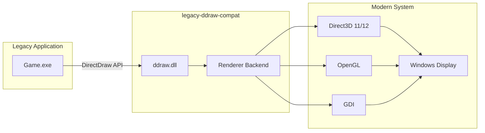

# Software Requirements Specification (SRS)

## legacy-ddraw-compat: DirectDraw Compatibility Layer

**Document ID:** SRS-001
**Version:** 1.0
**Date:** 2026-02-05
**Status:** Approved

---

## Table of Contents

1. [Introduction](#1-introduction)
2. [Overall Description](#2-overall-description)
3. [Functional Requirements](#3-functional-requirements)
4. [Non-Functional Requirements](#4-non-functional-requirements)
5. [External Interface Requirements](#5-external-interface-requirements)
6. [System Constraints](#6-system-constraints)

---

## 1. Introduction

### 1.1 Purpose

This Software Requirements Specification (SRS) defines the functional and non-functional requirements for the **legacy-ddraw-compat** project, a DirectDraw API compatibility layer for legacy Windows applications.

### 1.2 Scope

The legacy-ddraw-compat project delivers:

1. A drop-in replacement DLL (`ddraw.dll`) implementing the DirectDraw API
2. Multiple rendering backends for modern graphics hardware
3. Configuration system for customization
4. Diagnostic and logging capabilities

### 1.3 Definitions, Acronyms, and Abbreviations

| Term | Definition |
|------|------------|
| DirectDraw | Microsoft's legacy 2D graphics API, part of DirectX |
| DDraw | Abbreviation for DirectDraw |
| IDirectDraw | Primary DirectDraw COM interface |
| IDirectDrawSurface | DirectDraw surface interface for pixel data |
| IAT | Import Address Table (PE format structure) |
| COM | Component Object Model (Microsoft's binary interface standard) |
| GDI | Graphics Device Interface (Windows graphics subsystem) |
| VSync | Vertical Synchronization |
| FPS | Frames Per Second |
| BPP | Bits Per Pixel |
| LDC | legacy-ddraw-compat (project abbreviation) |

### 1.4 References

| ID | Document | Description |
|----|----------|-------------|
| REF-001 | Reference_Analysis.md | Upstream cnc-ddraw analysis |
| REF-002 | Reuse_Plan.md | Code reuse planning |
| REF-003 | Microsoft DirectDraw SDK | API specification |
| REF-004 | Windows SDK Documentation | Platform APIs |

### 1.5 Document Overview

- **Section 2**: Product context and user characteristics
- **Section 3**: Detailed functional requirements
- **Section 4**: Non-functional requirements (performance, reliability)
- **Section 5**: External interface specifications
- **Section 6**: Constraints and limitations

---

## 2. Overall Description

### 2.1 Product Perspective

legacy-ddraw-compat operates as a system-level compatibility shim:

### 2.2 Product Functions

| Function Category | Description |
|-------------------|-------------|
| API Emulation | Implement DirectDraw interfaces (IDirectDraw through IDirectDraw7) |
| Surface Management | Create, manage, and render DirectDraw surfaces |
| Display Mode Handling | Emulate legacy display mode changes |
| Rendering | Translate surface operations to modern graphics APIs |
| Configuration | User-configurable behavior via INI files |
| Diagnostics | Logging, crash dumps, performance metrics |

### 2.3 User Characteristics

| User Type | Description | Technical Level |
|-----------|-------------|-----------------|
| End User | Runs legacy games/applications | Low-Medium |
| Power User | Configures compatibility settings | Medium |
| Developer | Integrates with or extends the library | High |

### 2.4 Operating Environment

| Component | Requirement |
|-----------|-------------|
| Operating System | Windows 7 SP1 through Windows 11 |
| Architecture | x86 (32-bit) and x64 (64-bit) |
| Runtime | Visual C++ Redistributable 2022 |
| Graphics | DirectX 9.0c capable GPU (for D3D9 renderer) |
| Alternative | Any GPU with OpenGL 2.1+ or GDI support |

### 2.5 Design and Implementation Constraints

| Constraint | Description |
|------------|-------------|
| C-001 | Must be loadable as `ddraw.dll` drop-in replacement |
| C-002 | Must not require administrator privileges for normal operation |
| C-003 | Must support both x86 and x64 builds |
| C-004 | Must be buildable with Visual Studio 2022 |
| C-005 | Must minimize external dependencies |

### 2.6 Assumptions and Dependencies

See `Assumptions.md` for detailed assumptions.

| ID | Assumption |
|----|------------|
| A-001 | Target applications use standard DirectDraw API (not undocumented) |
| A-002 | System has functioning graphics driver |
| A-003 | User has write access to application directory (for config/logs) |

---

## 3. Functional Requirements

### 3.1 DirectDraw Interface Emulation

#### FR-001: IDirectDraw Interface Support

| Attribute | Value |
|-----------|-------|
| ID | FR-001 |
| Priority | Critical |
| Description | Implement IDirectDraw COM interface |

**Requirement:** The system SHALL implement the IDirectDraw interface with all methods:

| Method | Implementation Status |
|--------|----------------------|
| QueryInterface | Required |
| AddRef | Required |
| Release | Required |
| Compact | Stub (return DD_OK) |
| CreateClipper | Required |
| CreatePalette | Required |
| CreateSurface | Required |
| DuplicateSurface | Required |
| EnumDisplayModes | Required |
| EnumSurfaces | Required |
| FlipToGDISurface | Required |
| GetCaps | Required |
| GetDisplayMode | Required |
| GetFourCCCodes | Stub |
| GetGDISurface | Required |
| GetMonitorFrequency | Required |
| GetScanLine | Stub |
| GetVerticalBlankStatus | Required |
| Initialize | Required |
| RestoreDisplayMode | Required |
| SetCooperativeLevel | Required |
| SetDisplayMode | Required |
| WaitForVerticalBlank | Required |

#### FR-002: IDirectDraw2 Interface Support

| Attribute | Value |
|-----------|-------|
| ID | FR-002 |
| Priority | High |
| Description | Implement IDirectDraw2 COM interface |

**Requirement:** The system SHALL implement IDirectDraw2, adding:

| Method | Implementation Status |
|--------|----------------------|
| GetAvailableVidMem | Required |
| SetDisplayMode (extended) | Required |

#### FR-003: IDirectDraw4 Interface Support

| Attribute | Value |
|-----------|-------|
| ID | FR-003 |
| Priority | High |
| Description | Implement IDirectDraw4 COM interface |

**Requirement:** The system SHALL implement IDirectDraw4, adding:

| Method | Implementation Status |
|--------|----------------------|
| GetSurfaceFromDC | Required |
| RestoreAllSurfaces | Required |
| TestCooperativeLevel | Required |
| GetDeviceIdentifier | Required |

#### FR-004: IDirectDraw7 Interface Support

| Attribute | Value |
|-----------|-------|
| ID | FR-004 |
| Priority | High |
| Description | Implement IDirectDraw7 COM interface |

**Requirement:** The system SHALL implement IDirectDraw7, adding:

| Method | Implementation Status |
|--------|----------------------|
| StartModeTest | Stub |
| EvaluateMode | Stub |

---

### 3.2 Surface Management

#### FR-010: Primary Surface Creation

| Attribute | Value |
|-----------|-------|
| ID | FR-010 |
| Priority | Critical |
| Description | Create and manage primary display surface |

**Requirement:** The system SHALL support creation of primary surfaces with:
- Single-buffered configuration
- Double-buffered (with back buffer) configuration
- Triple-buffered configuration

#### FR-011: Off-Screen Surface Creation

| Attribute | Value |
|-----------|-------|
| ID | FR-011 |
| Priority | Critical |
| Description | Create off-screen plain surfaces |

**Requirement:** The system SHALL support off-screen surfaces with:
- System memory allocation
- Video memory emulation
- Arbitrary dimensions up to 8192x8192

#### FR-012: Surface Locking

| Attribute | Value |
|-----------|-------|
| ID | FR-012 |
| Priority | Critical |
| Description | Provide CPU access to surface memory |

**Requirement:** The system SHALL implement `Lock`/`Unlock` methods providing:
- Direct pointer to surface pixel data
- Correct pitch calculation
- Read-only and read-write access modes
- Partial surface locking (rectangular regions)

#### FR-013: Blit Operations

| Attribute | Value |
|-----------|-------|
| ID | FR-013 |
| Priority | Critical |
| Description | Implement bit-block transfer operations |

**Requirement:** The system SHALL implement `Blt` and `BltFast` with:
- Source-to-destination copying
- Color key transparency (source and destination)
- Stretching and shrinking
- Color fill operations
- Mirroring (horizontal and vertical)

#### FR-014: Flip Operations

| Attribute | Value |
|-----------|-------|
| ID | FR-014 |
| Priority | Critical |
| Description | Implement page flipping |

**Requirement:** The system SHALL implement `Flip` method supporting:
- Immediate flip
- VSync-synchronized flip
- Flip to specific surface in chain

---

### 3.3 Palette Support

#### FR-020: Palette Creation

| Attribute | Value |
|-----------|-------|
| ID | FR-020 |
| Priority | High |
| Description | Create DirectDraw palette objects |

**Requirement:** The system SHALL support palette creation for:
- 8-bit (256 color) palettes
- 4-bit (16 color) palettes (if requested)

#### FR-021: Palette Attachment

| Attribute | Value |
|-----------|-------|
| ID | FR-021 |
| Priority | High |
| Description | Attach palettes to surfaces |

**Requirement:** The system SHALL allow palettes to be attached to 8-bit surfaces and update rendering accordingly when palette entries change.

---

### 3.4 Display Mode Management

#### FR-030: Display Mode Enumeration

| Attribute | Value |
|-----------|-------|
| ID | FR-030 |
| Priority | Critical |
| Description | Enumerate available display modes |

**Requirement:** The system SHALL enumerate display modes including:
- Standard resolutions (640x480, 800x600, 1024x768, etc.)
- Color depths: 8-bit, 16-bit, 24-bit, 32-bit
- Custom resolutions via configuration

#### FR-031: Display Mode Setting

| Attribute | Value |
|-----------|-------|
| ID | FR-031 |
| Priority | Critical |
| Description | Set display mode |

**Requirement:** The system SHALL handle `SetDisplayMode` by:
- Creating appropriately sized window (windowed mode)
- Setting exclusive fullscreen (fullscreen mode)
- Emulating display mode change without actual mode switch (borderless)

#### FR-032: Display Mode Restoration

| Attribute | Value |
|-----------|-------|
| ID | FR-032 |
| Priority | High |
| Description | Restore original display mode |

**Requirement:** The system SHALL restore the original display configuration when `RestoreDisplayMode` is called or the application terminates.

---

### 3.5 Rendering Backend

#### FR-040: GDI Renderer

| Attribute | Value |
|-----------|-------|
| ID | FR-040 |
| Priority | Critical |
| Description | Software rendering via GDI |

**Requirement:** The system SHALL provide a GDI-based renderer that:
- Works on any Windows system
- Supports all color depths
- Does not require hardware acceleration

#### FR-041: Direct3D 9 Renderer

| Attribute | Value |
|-----------|-------|
| ID | FR-041 |
| Priority | High |
| Description | Hardware-accelerated rendering via D3D9 |

**Requirement:** The system SHALL provide a Direct3D 9 renderer that:
- Utilizes GPU for presentation
- Supports shader-based scaling
- Provides VSync support

#### FR-042: OpenGL Renderer

| Attribute | Value |
|-----------|-------|
| ID | FR-042 |
| Priority | Medium |
| Description | Hardware-accelerated rendering via OpenGL |

**Requirement:** The system SHALL provide an OpenGL renderer that:
- Requires OpenGL 2.1 or later
- Supports shader-based effects
- Provides cross-platform rendering path

#### FR-043: Automatic Renderer Selection

| Attribute | Value |
|-----------|-------|
| ID | FR-043 |
| Priority | High |
| Description | Automatically select best available renderer |

**Requirement:** The system SHALL automatically select the most capable available renderer in order of preference: D3D9 > OpenGL > GDI.

---

### 3.6 Configuration System

#### FR-050: INI Configuration File

| Attribute | Value |
|-----------|-------|
| ID | FR-050 |
| Priority | High |
| Description | INI-based configuration |

**Requirement:** The system SHALL read configuration from `ddraw.ini` in the application directory, supporting:
- Global settings in `[ddraw]` section
- Per-application settings in `[executable.exe]` sections
- Comments (lines starting with `;` or `#`)

#### FR-051: Configuration Validation

| Attribute | Value |
|-----------|-------|
| ID | FR-051 |
| Priority | Medium |
| Description | Validate configuration values |

**Requirement:** The system SHALL validate configuration values and use defaults for invalid entries, logging warnings.

#### FR-052: Runtime Configuration

| Attribute | Value |
|-----------|-------|
| ID | FR-052 |
| Priority | Low |
| Description | Runtime configuration queries |

**Requirement:** The system SHALL provide internal API for querying current configuration values.

---

### 3.7 Logging and Diagnostics

#### FR-060: File Logging

| Attribute | Value |
|-----------|-------|
| ID | FR-060 |
| Priority | High |
| Description | Log to file |

**Requirement:** The system SHALL log diagnostic information to `ddraw.log` with:
- Timestamp for each entry
- Log level (ERROR, WARN, INFO, DEBUG)
- Thread identification

#### FR-061: Log Rotation

| Attribute | Value |
|-----------|-------|
| ID | FR-061 |
| Priority | Low |
| Description | Rotate log files |

**Requirement:** The system SHALL rotate log files when they exceed 50MB, keeping up to 3 historical files.

#### FR-062: Crash Dump Generation

| Attribute | Value |
|-----------|-------|
| ID | FR-062 |
| Priority | Medium |
| Description | Generate crash dumps |

**Requirement:** The system SHALL generate minidump files on unhandled exceptions when enabled in configuration.

---

### 3.8 Window Management

#### FR-070: Windowed Mode

| Attribute | Value |
|-----------|-------|
| ID | FR-070 |
| Priority | Critical |
| Description | Run in windowed mode |

**Requirement:** The system SHALL support running applications in a resizable or fixed-size window.

#### FR-071: Borderless Fullscreen

| Attribute | Value |
|-----------|-------|
| ID | FR-071 |
| Priority | High |
| Description | Borderless fullscreen mode |

**Requirement:** The system SHALL support borderless fullscreen mode (maximized borderless window).

#### FR-072: Exclusive Fullscreen

| Attribute | Value |
|-----------|-------|
| ID | FR-072 |
| Priority | Medium |
| Description | True exclusive fullscreen |

**Requirement:** The system SHALL support exclusive fullscreen mode when requested.

#### FR-073: Fullscreen Toggle

| Attribute | Value |
|-----------|-------|
| ID | FR-073 |
| Priority | Medium |
| Description | Alt+Enter fullscreen toggle |

**Requirement:** The system SHALL support toggling between windowed and fullscreen modes via configurable hotkey (default: Alt+Enter).

---

## 4. Non-Functional Requirements

### 4.1 Performance

#### NFR-001: Frame Rate

| Attribute | Value |
|-----------|-------|
| ID | NFR-001 |
| Category | Performance |
| Description | Minimal frame rate impact |

**Requirement:** The compatibility layer SHALL introduce no more than 5% frame rate overhead compared to native DirectDraw (when available).

#### NFR-002: Input Latency

| Attribute | Value |
|-----------|-------|
| ID | NFR-002 |
| Category | Performance |
| Description | Minimal input latency |

**Requirement:** The system SHALL not introduce more than 1 frame of additional input latency.

#### NFR-003: Memory Usage

| Attribute | Value |
|-----------|-------|
| ID | NFR-003 |
| Category | Performance |
| Description | Reasonable memory footprint |

**Requirement:** The DLL SHALL not consume more than 50MB of additional memory beyond surface allocations.

---

### 4.2 Reliability

#### NFR-010: Stability

| Attribute | Value |
|-----------|-------|
| ID | NFR-010 |
| Category | Reliability |
| Description | Stable operation |

**Requirement:** The system SHALL not crash or hang during normal operation with compatible applications.

#### NFR-011: Graceful Degradation

| Attribute | Value |
|-----------|-------|
| ID | NFR-011 |
| Category | Reliability |
| Description | Handle missing capabilities |

**Requirement:** The system SHALL gracefully fall back to simpler renderers if preferred renderer fails to initialize.

#### NFR-012: Error Recovery

| Attribute | Value |
|-----------|-------|
| ID | NFR-012 |
| Category | Reliability |
| Description | Recover from errors |

**Requirement:** The system SHALL attempt to recover from transient errors (lost devices, resource exhaustion) where possible.

---

### 4.3 Compatibility

#### NFR-020: Windows Version Support

| Attribute | Value |
|-----------|-------|
| ID | NFR-020 |
| Category | Compatibility |
| Description | Support Windows 7 through 11 |

**Requirement:** The system SHALL function correctly on Windows 7 SP1, Windows 8, Windows 8.1, Windows 10, and Windows 11.

#### NFR-021: Wine Compatibility

| Attribute | Value |
|-----------|-------|
| ID | NFR-021 |
| Category | Compatibility |
| Description | Function under Wine |

**Requirement:** The system SHOULD function correctly under Wine/Proton with appropriate configuration.

---

### 4.4 Maintainability

#### NFR-030: Code Documentation

| Attribute | Value |
|-----------|-------|
| ID | NFR-030 |
| Category | Maintainability |
| Description | Documented codebase |

**Requirement:** All source files SHALL include header documentation and inline comments for complex logic.

#### NFR-031: Modular Architecture

| Attribute | Value |
|-----------|-------|
| ID | NFR-031 |
| Category | Maintainability |
| Description | Modular design |

**Requirement:** The codebase SHALL be organized into distinct modules with well-defined interfaces.

---

### 4.5 Testability

#### NFR-040: Unit Testability

| Attribute | Value |
|-----------|-------|
| ID | NFR-040 |
| Category | Testability |
| Description | Unit testable components |

**Requirement:** Core logic components SHALL be designed for unit testing without requiring DirectDraw initialization.

---

## 5. External Interface Requirements

### 5.1 User Interfaces

#### EI-001: No GUI Required

The system SHALL NOT require a graphical configuration interface for basic operation. Configuration is file-based.

### 5.2 Software Interfaces

#### EI-010: DirectDraw API

| Interface | Description |
|-----------|-------------|
| API | DirectDraw 7.0 (ddraw.h) |
| Version | DirectX 7.0 compatible |
| Direction | Incoming (from application) |

#### EI-011: Direct3D 9 API

| Interface | Description |
|-----------|-------------|
| API | Direct3D 9.0c (d3d9.h) |
| Version | June 2010 SDK compatible |
| Direction | Outgoing (to graphics driver) |

#### EI-012: OpenGL API

| Interface | Description |
|-----------|-------------|
| API | OpenGL 2.1+ |
| Version | Core profile |
| Direction | Outgoing (to graphics driver) |

#### EI-013: Windows GDI API

| Interface | Description |
|-----------|-------------|
| API | Windows GDI (wingdi.h) |
| Version | Windows 7+ |
| Direction | Outgoing (to graphics subsystem) |

### 5.3 Communication Interfaces

Not applicable. The system operates locally within a single process.

---

## 6. System Constraints

### 6.1 Regulatory Requirements

None identified.

### 6.2 Hardware Limitations

| Constraint | Description |
|------------|-------------|
| GPU | Minimum DirectX 9 capable (for D3D9 renderer) |
| Memory | Minimum 512MB RAM available |
| Storage | Minimum 10MB disk space |

### 6.3 Software Limitations

| Constraint | Description |
|------------|-------------|
| OS | Windows 7 SP1 minimum |
| Runtime | Visual C++ 2022 Redistributable |
| Architecture | x86 or x64 (matching target application) |

---

## Appendix A: Requirements Index

| Requirement ID | Title | Priority |
|----------------|-------|----------|
| FR-001 | IDirectDraw Interface | Critical |
| FR-002 | IDirectDraw2 Interface | High |
| FR-003 | IDirectDraw4 Interface | High |
| FR-004 | IDirectDraw7 Interface | High |
| FR-010 | Primary Surface Creation | Critical |
| FR-011 | Off-Screen Surface Creation | Critical |
| FR-012 | Surface Locking | Critical |
| FR-013 | Blit Operations | Critical |
| FR-014 | Flip Operations | Critical |
| FR-020 | Palette Creation | High |
| FR-021 | Palette Attachment | High |
| FR-030 | Display Mode Enumeration | Critical |
| FR-031 | Display Mode Setting | Critical |
| FR-032 | Display Mode Restoration | High |
| FR-040 | GDI Renderer | Critical |
| FR-041 | Direct3D 9 Renderer | High |
| FR-042 | OpenGL Renderer | Medium |
| FR-043 | Automatic Renderer Selection | High |
| FR-050 | INI Configuration | High |
| FR-051 | Configuration Validation | Medium |
| FR-052 | Runtime Configuration | Low |
| FR-060 | File Logging | High |
| FR-061 | Log Rotation | Low |
| FR-062 | Crash Dump Generation | Medium |
| FR-070 | Windowed Mode | Critical |
| FR-071 | Borderless Fullscreen | High |
| FR-072 | Exclusive Fullscreen | Medium |
| FR-073 | Fullscreen Toggle | Medium |
| NFR-001 | Frame Rate | Performance |
| NFR-002 | Input Latency | Performance |
| NFR-003 | Memory Usage | Performance |
| NFR-010 | Stability | Reliability |
| NFR-011 | Graceful Degradation | Reliability |
| NFR-012 | Error Recovery | Reliability |
| NFR-020 | Windows Version Support | Compatibility |
| NFR-021 | Wine Compatibility | Compatibility |
| NFR-030 | Code Documentation | Maintainability |
| NFR-031 | Modular Architecture | Maintainability |
| NFR-040 | Unit Testability | Testability |

---

*End of Document*
