# Software System Description (SSD)

## legacy-ddraw-compat: DirectDraw Compatibility Layer

**Document ID:** SSD-001
**Version:** 1.0
**Date:** 2026-02-05
**Status:** Approved

---

## Table of Contents

1. [System Overview](#1-system-overview)
2. [System Architecture](#2-system-architecture)
3. [Component Descriptions](#3-component-descriptions)
4. [Data Flow](#4-data-flow)
5. [Threading Model](#5-threading-model)
6. [State Management](#6-state-management)
7. [Error Handling Strategy](#7-error-handling-strategy)

---

## 1. System Overview

### 1.1 Purpose

The legacy-ddraw-compat system provides a compatibility layer enabling legacy DirectDraw applications to run on modern Windows systems by intercepting DirectDraw API calls and translating them to modern graphics APIs.

### 1.2 System Context

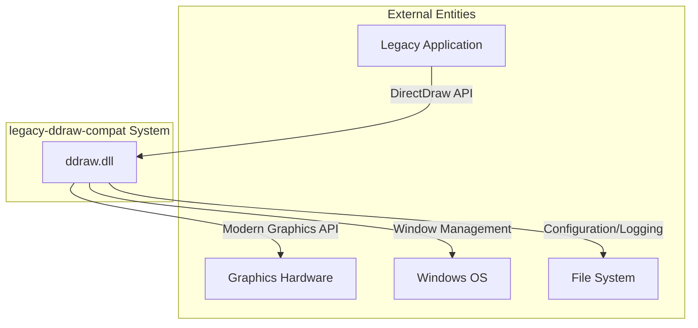

### 1.3 System Boundaries

| Boundary | Description |
|----------|-------------|
| Input | DirectDraw API calls from legacy applications |
| Output | Modern graphics API calls (D3D9/OpenGL/GDI) |
| Configuration | INI file in application directory |
| Logging | Log files in application directory |

---

## 2. System Architecture

### 2.1 High-Level Architecture

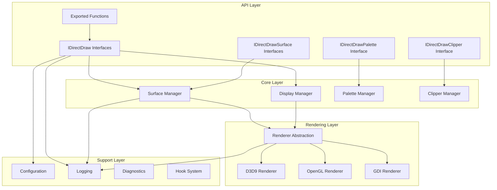

### 2.2 Layer Descriptions

| Layer | Purpose | Dependencies |
|-------|---------|--------------|
| API Layer | DirectDraw interface implementation | Core Layer |
| Core Layer | Business logic for surface/display management | Rendering Layer, Support Layer |
| Rendering Layer | Modern graphics API abstraction | Graphics drivers |
| Support Layer | Configuration, logging, diagnostics | File system, Windows API |

### 2.3 Component Inventory

| Component | Layer | Source Location | Primary Responsibility |
|-----------|-------|-----------------|------------------------|
| DllMain | Entry | `src/core/DllMain.cpp` | Initialization/cleanup |
| DirectDrawFactory | API | `src/core/DirectDrawFactory.cpp` | Object creation |
| DirectDrawImpl | API | `src/interfaces/DirectDrawImpl.cpp` | IDirectDraw methods |
| SurfaceImpl | API | `src/interfaces/SurfaceImpl.cpp` | IDirectDrawSurface methods |
| SurfaceManager | Core | `src/core/SurfaceManager.cpp` | Surface lifecycle |
| DisplayManager | Core | `src/core/DisplayManager.cpp` | Display mode handling |
| RendererBase | Rendering | `src/renderer/RendererBase.cpp` | Renderer interface |
| D3D9Renderer | Rendering | `src/renderer/D3D9Renderer.cpp` | Direct3D 9 backend |
| OpenGLRenderer | Rendering | `src/renderer/OpenGLRenderer.cpp` | OpenGL backend |
| GDIRenderer | Rendering | `src/renderer/GDIRenderer.cpp` | GDI backend |
| ConfigManager | Support | `src/config/ConfigManager.cpp` | Configuration loading |
| Logger | Support | `src/logging/Logger.cpp` | Logging services |
| IatHook | Support | `src/hooks/IatHook.cpp` | API interception |

---

## 3. Component Descriptions

### 3.1 Entry Components

#### 3.1.1 DllMain

**Purpose:** DLL entry point handling process attachment/detachment.

**Responsibilities:**
- Initialize logging subsystem
- Load configuration
- Install API hooks
- Set up exception handlers
- Clean up on process detach

**Interfaces:**
- Windows DLL entry point (`DllMain`)
- Exported DirectDraw functions

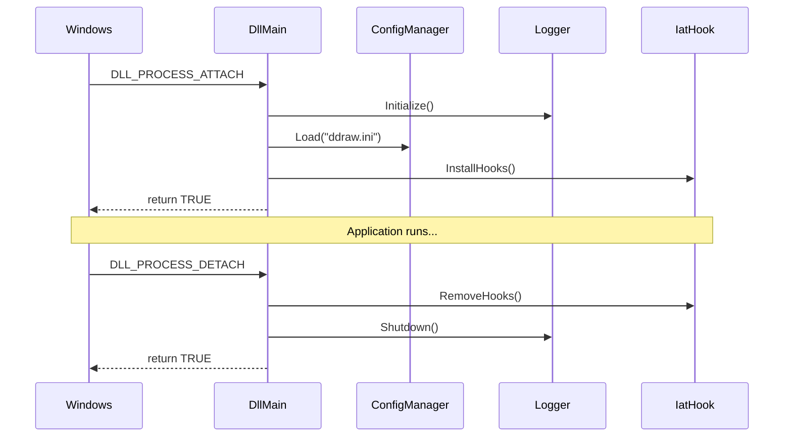

### 3.2 API Layer Components

#### 3.2.1 DirectDrawFactory

**Purpose:** Create DirectDraw objects via exported functions.

**Responsibilities:**
- Implement `DirectDrawCreate`
- Implement `DirectDrawCreateEx`
- Implement `DirectDrawEnumerateA/W`
- Implement `DirectDrawCreateClipper`

**Design Pattern:** Factory Method

#### 3.2.2 DirectDrawImpl

**Purpose:** Implement IDirectDraw interface family.

**Responsibilities:**
- Manage DirectDraw object lifecycle
- Delegate to managers for actual work
- Handle COM reference counting
- Support interface versioning (IDirectDraw through IDirectDraw7)

**Design Pattern:** Adapter (adapts internal managers to COM interface)

#### 3.2.3 SurfaceImpl

**Purpose:** Implement IDirectDrawSurface interface family.

**Responsibilities:**
- Provide surface methods (Lock, Unlock, Blt, Flip)
- Manage surface memory
- Coordinate with renderer for presentation
- Handle surface chaining (back buffers)

**Design Pattern:** Proxy (proxies to SurfaceManager)

### 3.3 Core Layer Components

#### 3.3.1 SurfaceManager

**Purpose:** Manage surface lifecycle and operations.

**Responsibilities:**
- Create/destroy surfaces
- Allocate surface memory
- Perform blit operations
- Track surface chains
- Coordinate with renderer

**Key Data Structures:**
```cpp
struct SurfaceDescriptor {
    uint32_t width;
    uint32_t height;
    uint32_t bpp;
    uint32_t pitch;
    SurfaceType type;
    void* pixels;
    // ...
};
```

#### 3.3.2 DisplayManager

**Purpose:** Handle display mode management.

**Responsibilities:**
- Enumerate display modes
- Set/restore display modes
- Manage window creation/sizing
- Handle fullscreen transitions
- Coordinate scaling factors

**State Machine:**
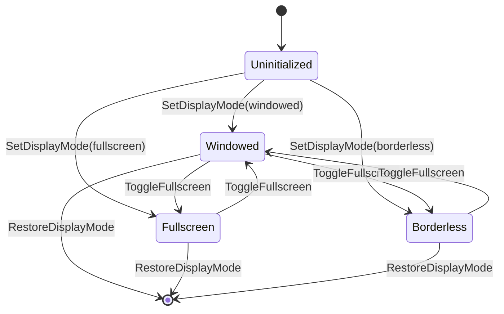

#### 3.3.3 PaletteManager

**Purpose:** Manage palette objects and 8-bit to 32-bit conversion.

**Responsibilities:**
- Create palette objects
- Update palette entries
- Generate conversion lookup tables
- Notify renderer of palette changes

### 3.4 Rendering Layer Components

#### 3.4.1 RendererBase (Abstract)

**Purpose:** Define renderer interface.

**Interface:**
```cpp
class IRenderer {
public:
    virtual bool Initialize(HWND hwnd, const DisplayMode& mode) = 0;
    virtual void Shutdown() = 0;
    virtual void Present(const Surface* primary) = 0;
    virtual void SetPalette(const uint32_t* palette) = 0;
    virtual bool IsAvailable() const = 0;
    virtual RendererType GetType() const = 0;
};
```

#### 3.4.2 D3D9Renderer

**Purpose:** Direct3D 9 rendering backend.

**Responsibilities:**
- Initialize D3D9 device
- Create presentation texture
- Handle device lost/reset
- Present frames with optional shaders

#### 3.4.3 OpenGLRenderer

**Purpose:** OpenGL rendering backend.

**Responsibilities:**
- Initialize OpenGL context
- Create presentation texture
- Support shader effects
- Present frames

#### 3.4.4 GDIRenderer

**Purpose:** GDI fallback renderer.

**Responsibilities:**
- Create compatible DC and bitmap
- Use StretchBlt for presentation
- Minimal hardware requirements

### 3.5 Support Layer Components

#### 3.5.1 ConfigManager

**Purpose:** Load and manage configuration.

**Responsibilities:**
- Parse INI files
- Validate configuration values
- Provide default values
- Support per-application sections

**Configuration Categories:**
| Category | Examples |
|----------|----------|
| Display | width, height, fullscreen, windowed |
| Rendering | renderer, vsync, maxfps |
| Compatibility | maxgameticks, singlecpu |
| Debug | loglevel, crashdumps |

#### 3.5.2 Logger

**Purpose:** Centralized logging.

**Features:**
- Log levels (ERROR, WARN, INFO, DEBUG, TRACE)
- Timestamp formatting
- Thread identification
- File rotation
- Conditional compilation for performance

**Log Format:**
```
[2026-02-05 14:32:15.123] [INFO ] [12345] Message here
```

#### 3.5.3 IatHook

**Purpose:** Windows API interception.

**Responsibilities:**
- Patch Import Address Tables
- Maintain original function pointers
- Support hook installation/removal
- Handle multiple modules

---

## 4. Data Flow

### 4.1 Surface Creation Flow

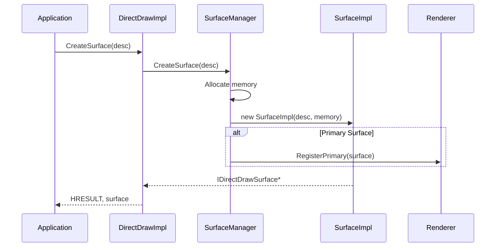

### 4.2 Rendering Flow (Flip)

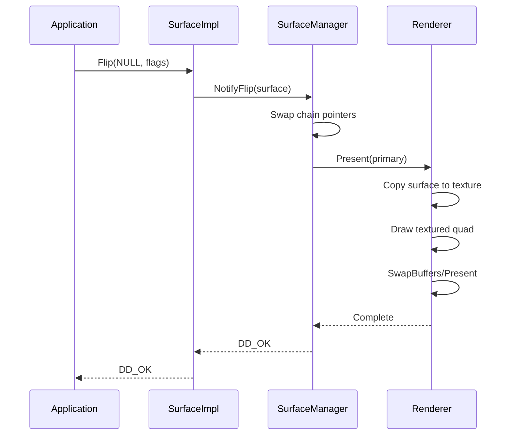

### 4.3 Configuration Flow

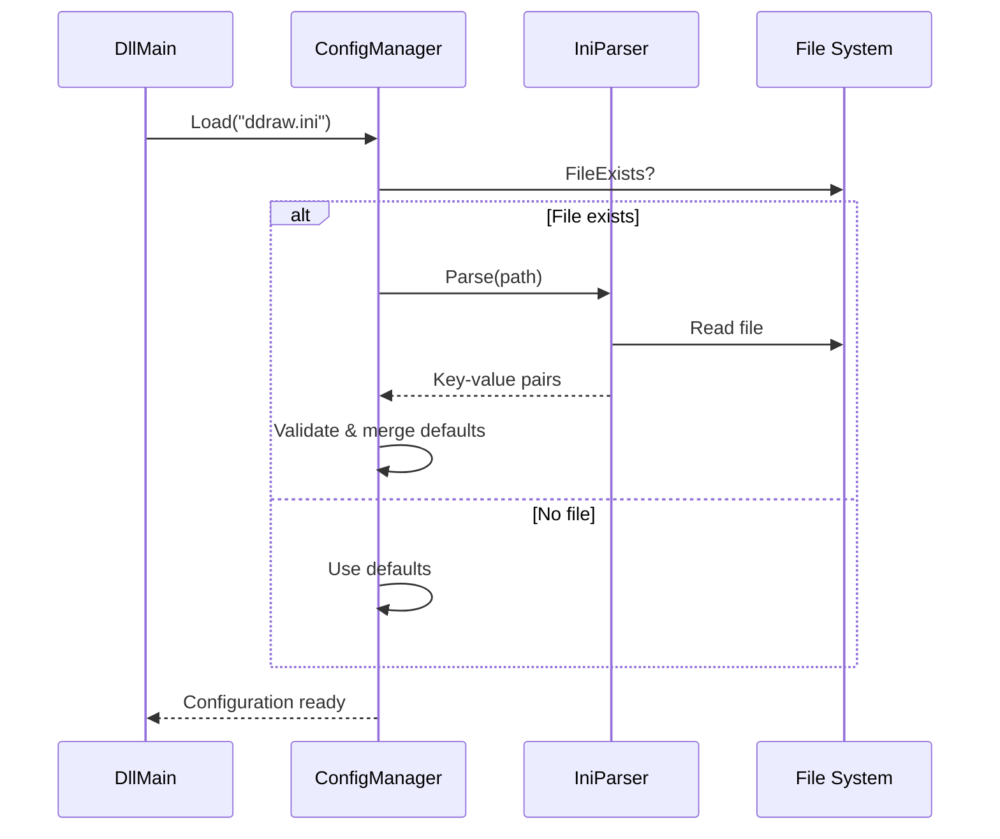

---

## 5. Threading Model

### 5.1 Thread Overview

| Thread | Purpose | Created By |
|--------|---------|------------|
| Main Thread | Application's main thread | Application |
| Render Thread | Asynchronous presentation | DisplayManager |
| (Optional) Timer Thread | FPS limiting | FrameLimiter |

### 5.2 Thread Interaction

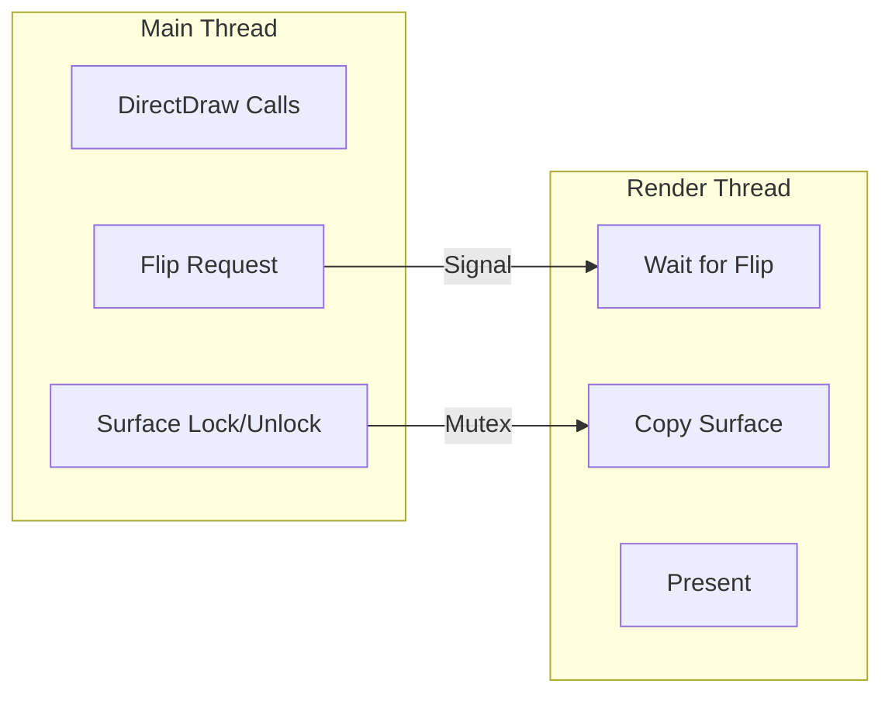

### 5.3 Synchronization Primitives

| Primitive | Purpose | Location |
|-----------|---------|----------|
| Critical Section | Surface memory access | SurfaceManager |
| Event | Flip notification | DisplayManager |
| Mutex | Configuration access | ConfigManager |

### 5.4 Thread Safety Requirements

| Component | Thread Safety |
|-----------|---------------|
| ConfigManager | Thread-safe after initialization |
| Logger | Thread-safe (internal locking) |
| SurfaceManager | Requires external synchronization for surface access |
| Renderer | Single-threaded (render thread only) |

---

## 6. State Management

### 6.1 Global State

The system maintains minimal global state:

```cpp
struct GlobalState {
    ConfigManager* config;      // Configuration singleton
    Logger* logger;             // Logging singleton
    DirectDrawImpl* ddraw;      // Current DirectDraw object (single instance)
    DisplayManager* display;    // Display state
    IRenderer* renderer;        // Active renderer
};
```

### 6.2 DirectDraw Object State

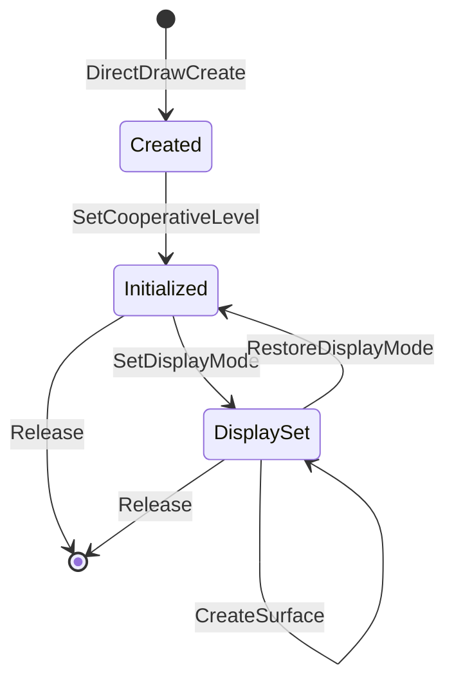

### 6.3 Surface State

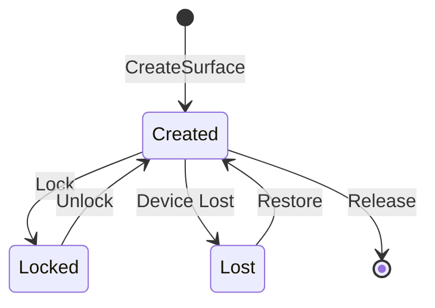

---

## 7. Error Handling Strategy

### 7.1 Error Categories

| Category | Examples | Handling |
|----------|----------|----------|
| Configuration | Invalid INI values | Log warning, use default |
| Initialization | Renderer init failure | Fall back to simpler renderer |
| Runtime | Surface lock failure | Return error code to application |
| Fatal | Out of memory | Log, generate crash dump, terminate |

### 7.2 Error Propagation

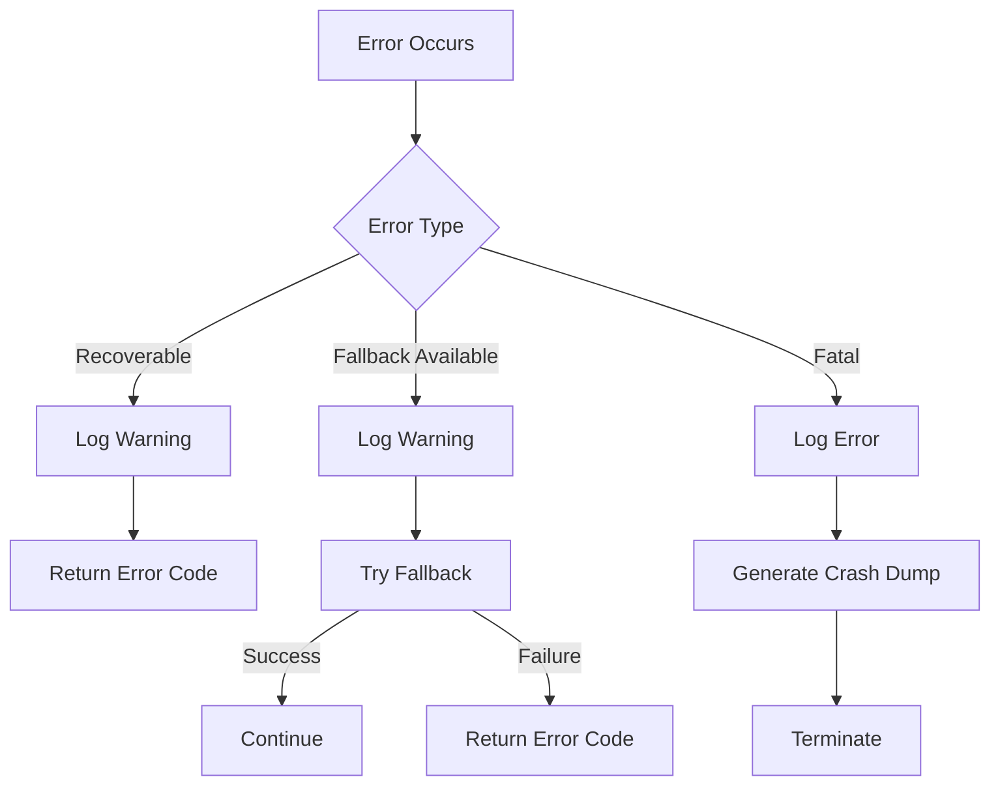

### 7.3 DirectDraw Error Codes

| Code | Meaning | When Used |
|------|---------|-----------|
| DD_OK | Success | Normal operation |
| DDERR_INVALIDPARAMS | Invalid parameters | Bad input validation |
| DDERR_OUTOFMEMORY | Out of memory | Allocation failure |
| DDERR_SURFACELOST | Surface needs restore | Device lost |
| DDERR_UNSUPPORTED | Not implemented | Stub methods |
| DDERR_GENERIC | General failure | Catch-all |

### 7.4 Logging Integration

All errors are logged before being returned:

```cpp
HRESULT LogAndReturn(HRESULT hr, const char* context) {
    if (FAILED(hr)) {
        LOG_ERROR("{}: {}", context, HResultToString(hr));
    }
    return hr;
}
```

---

## Appendix A: Directory Structure

```
legacy-ddraw-compat/
├── docs/
│   ├── Reference_Analysis.md
│   ├── Reuse_Plan.md
│   ├── SRS.md
│   ├── SSD.md (this document)
│   ├── SDD.md
│   ├── ICD.md
│   ├── Traceability_Matrix.md
│   ├── Test_Plan.md
│   ├── Build_and_Release.md
│   └── Assumptions.md
├── include/
│   ├── core/
│   ├── interfaces/
│   ├── renderer/
│   ├── config/
│   ├── logging/
│   ├── diagnostics/
│   └── hooks/
├── src/
│   ├── core/
│   ├── interfaces/
│   ├── renderer/
│   ├── config/
│   ├── logging/
│   ├── diagnostics/
│   ├── hooks/
│   └── third_party_derived/
├── tests/
│   ├── unit/
│   └── integration/
├── configs/
└── tools/
```

---

*End of Document*
