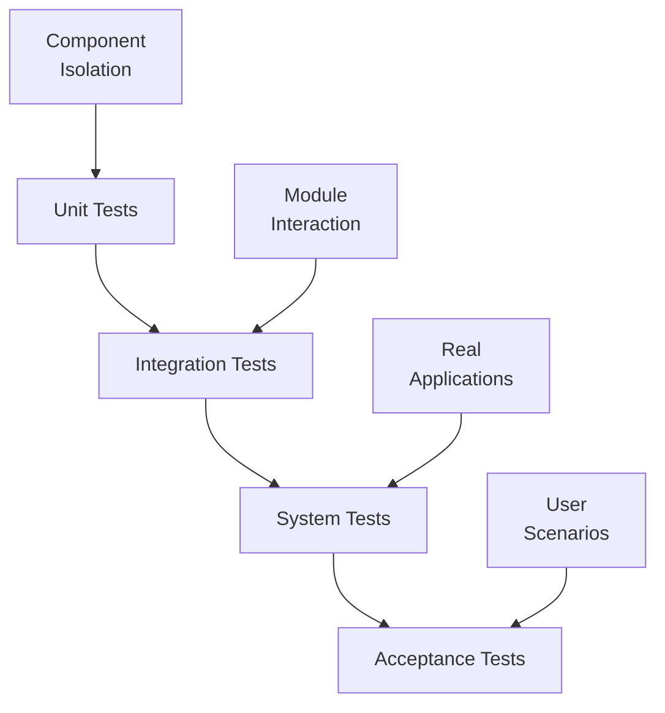

# Test Plan

## legacy-ddraw-compat: DirectDraw Compatibility Layer

**Document ID:** TP-001
**Version:** 1.0
**Date:** 2026-02-05
**Status:** Approved

---

## Table of Contents

1. [Introduction](#1-introduction)
2. [Test Strategy](#2-test-strategy)
3. [Test Environment](#3-test-environment)
4. [Unit Tests](#4-unit-tests)
5. [Integration Tests](#5-integration-tests)
6. [System Tests](#6-system-tests)
7. [Performance Tests](#7-performance-tests)
8. [Test Procedures](#8-test-procedures)

---

## 1. Introduction

### 1.1 Purpose

This Test Plan defines the testing approach, test cases, and acceptance criteria for the legacy-ddraw-compat project.

### 1.2 Scope

Testing covers:
- Unit testing of individual components
- Integration testing of module interactions
- System testing with real applications
- Performance testing for overhead measurement

### 1.3 Test Objectives

| Objective | Description |
|-----------|-------------|
| TO-001 | Verify DirectDraw API compliance |
| TO-002 | Verify renderer functionality |
| TO-003 | Verify configuration system |
| TO-004 | Verify logging and diagnostics |
| TO-005 | Measure performance overhead |
| TO-006 | Validate compatibility with target applications |

---

## 2. Test Strategy

### 2.1 Test Levels



### 2.2 Test Types

| Type | Scope | Automation |
|------|-------|------------|
| Unit | Single class/function | Automated (GoogleTest) |
| Integration | Multiple components | Automated |
| System | Full DLL with applications | Semi-automated |
| Performance | Timing and resource usage | Automated benchmarks |
| Regression | Previously fixed bugs | Automated |

### 2.3 Test Criteria

#### 2.3.1 Entry Criteria

- Code compiles without errors
- Code review completed
- Unit tests for new code written

#### 2.3.2 Exit Criteria

- All critical tests pass
- Code coverage >= 80% for core modules
- No known critical or high-severity bugs
- Performance meets requirements

### 2.4 Test Framework

- **Unit Tests:** Google Test (gtest)
- **Mocking:** Google Mock (gmock)
- **Coverage:** Visual Studio Code Coverage / OpenCppCoverage
- **CI:** GitHub Actions

---

## 3. Test Environment

### 3.1 Hardware Requirements

| Component | Minimum | Recommended |
|-----------|---------|-------------|
| CPU | Dual-core 2.0 GHz | Quad-core 3.0 GHz |
| RAM | 4 GB | 8 GB |
| GPU | DirectX 9 capable | DirectX 11 capable |
| Storage | 10 GB free | 50 GB free |

### 3.2 Software Requirements

| Software | Version | Purpose |
|----------|---------|---------|
| Windows | 10 (1903+) | Primary test OS |
| Windows | 7 SP1 | Compatibility testing |
| Windows | 11 | Compatibility testing |
| Visual Studio | 2022 | Build and debug |
| Google Test | 1.14+ | Unit testing |
| Wine | 8.0+ | Linux compatibility |

### 3.3 Test Applications

| Application | Type | Testing Purpose |
|-------------|------|-----------------|
| Test Harness | Custom | API verification |
| StarCraft | Game | Real-world 8-bit palettized |
| Diablo | Game | Real-world DirectDraw |
| Age of Empires | Game | Real-world compatibility |
| C&C: Red Alert | Game | Reference compatibility |

---

## 4. Unit Tests

### 4.1 Test Suites

#### 4.1.1 Configuration Module (TC-CFG)

**File:** `tests/unit/ConfigTests.cpp`

| Test ID | Test Name | Description | Expected Result |
|---------|-----------|-------------|-----------------|
| TC-202-001 | ParseValidIni | Parse well-formed INI file | All values extracted |
| TC-202-002 | ParseEmptyFile | Parse empty INI file | Empty config, no errors |
| TC-202-003 | ParseMissingFile | Open nonexistent file | Returns false |
| TC-202-004 | ParseWithComments | Parse file with ; and # comments | Comments ignored |
| TC-202-005 | ParseStringValue | Read string configuration value | Correct string returned |
| TC-202-006 | ParseIntValue | Read integer configuration value | Correct int returned |
| TC-202-007 | ParseBoolValue | Read boolean (true/false/1/0) | Correct bool returned |
| TC-202-008 | ParseWithWhitespace | Parse values with spaces | Whitespace trimmed |
| TC-202-009 | GetNonexistentKey | Request missing key | Default value returned |
| TC-202-010 | GetNonexistentSection | Request from missing section | Default value returned |
| TC-201-001 | LoadValidConfig | Load complete configuration | All settings applied |
| TC-201-002 | ValidateConfig | Validate out-of-range values | Values clamped/defaulted |
| TC-201-003 | ApplyDefaults | Missing values get defaults | Defaults applied |
| TC-201-004 | PerGameOverride | Game-specific section overrides | Override values used |

```cpp
// Example test case
TEST(IniParserTest, ParseValidIni) {
    IniParser parser;
    ASSERT_TRUE(parser.Open("test_data/valid.ini"));

    EXPECT_EQ(parser.GetString("ddraw", "renderer", ""), "d3d9");
    EXPECT_EQ(parser.GetInt("ddraw", "maxfps", 0), 60);
    EXPECT_TRUE(parser.GetBool("ddraw", "vsync", false));
}
```

#### 4.1.2 Logging Module (TC-LOG)

**File:** `tests/unit/LoggingTests.cpp`

| Test ID | Test Name | Description | Expected Result |
|---------|-----------|-------------|-----------------|
| TC-301-001 | InitializeLogger | Initialize logging system | Log file created |
| TC-301-002 | LogAtLevel | Log messages at each level | Messages written appropriately |
| TC-301-003 | FilterByLevel | Set minimum log level | Lower levels filtered |
| TC-301-004 | ThreadSafety | Log from multiple threads | No corruption/interleaving |
| TC-301-005 | FormatTimestamp | Timestamp formatting | Correct format |
| TC-301-006 | FormatThreadId | Thread ID in log entry | Correct thread ID |
| TC-301-007 | RotateOnSize | Log rotation at size limit | New file created |
| TC-301-008 | KeepMaxFiles | Respect max file count | Old files deleted |

#### 4.1.3 Surface Manager (TC-CORE-004)

**File:** `tests/unit/SurfaceManagerTests.cpp`

| Test ID | Test Name | Description | Expected Result |
|---------|-----------|-------------|-----------------|
| TC-004-001 | BlitSimple | Blit without transformation | Pixels copied correctly |
| TC-004-002 | BlitWithStretch | Blit with scaling | Correct interpolation |
| TC-004-003 | BlitWithColorKey | Blit with transparency | Color key pixels skipped |
| TC-004-004 | ColorFill8 | Fill 8-bit surface | Surface filled |
| TC-004-005 | ColorFill16 | Fill 16-bit surface | Surface filled |
| TC-004-006 | ColorFill32 | Fill 32-bit surface | Surface filled |
| TC-004-007 | PaletteConvert | 8-bit to 32-bit with palette | Correct color mapping |

```cpp
// Example test case
TEST(SurfaceManagerTest, BlitSimple) {
    uint8_t src[16] = {1, 2, 3, 4, 5, 6, 7, 8, 9, 10, 11, 12, 13, 14, 15, 16};
    uint8_t dst[16] = {0};

    SurfaceManager::BlitSurface(
        dst, 4,    // dst, dstPitch
        src, 4,    // src, srcPitch
        4, 4,      // width, height
        8          // bpp
    );

    EXPECT_EQ(memcmp(src, dst, 16), 0);
}
```

#### 4.1.4 CRC32 (TC-DIAG)

**File:** `tests/unit/Crc32Tests.cpp`

| Test ID | Test Name | Description | Expected Result |
|---------|-----------|-------------|-----------------|
| TC-501-001 | EmptyInput | CRC of empty data | 0x00000000 |
| TC-501-002 | KnownVector1 | "123456789" | 0xCBF43926 |
| TC-501-003 | KnownVector2 | All zeros (256 bytes) | Known value |
| TC-501-004 | StreamingCalc | Calculate in chunks | Same as single call |

#### 4.1.5 IAT Hook (TC-HOOK)

**File:** `tests/unit/IatHookTests.cpp`

| Test ID | Test Name | Description | Expected Result |
|---------|-----------|-------------|-----------------|
| TC-401-001 | FindIatEntry | Locate function in IAT | Returns valid pointer |
| TC-401-002 | InstallHook | Install hook | Original saved, hook active |
| TC-401-003 | RemoveHook | Remove installed hook | Original restored |
| TC-401-004 | HookNonexistent | Hook missing function | Returns false |
| TC-401-005 | MultipleHooks | Install multiple hooks | All hooks active |
| TC-401-006 | RemoveAll | Remove all hooks | All originals restored |

### 4.2 Test Data

Test data files located in `tests/data/`:

| File | Purpose |
|------|---------|
| `valid.ini` | Well-formed configuration |
| `empty.ini` | Empty configuration file |
| `malformed.ini` | Invalid INI syntax |
| `test_palette.pal` | 256-color test palette |
| `test_8bpp.raw` | 8-bit test image |
| `test_16bpp.raw` | 16-bit test image |
| `test_32bpp.raw` | 32-bit test image |

---

## 5. Integration Tests

### 5.1 Component Integration

**File:** `tests/integration/IntegrationTests.cpp`

| Test ID | Test Name | Components | Description |
|---------|-----------|------------|-------------|
| TI-001 | CreateAndRelease | Factory, DirectDrawImpl | Create and release object |
| TI-002 | SetModeCreateSurface | DisplayManager, SurfaceManager | Full surface creation flow |
| TI-003 | SurfaceToRenderer | SurfaceImpl, Renderer | Present surface content |
| TI-004 | ConfigToComponents | ConfigManager, All | Config affects behavior |
| TI-005 | PaletteToRenderer | PaletteImpl, Renderer | Palette changes update display |

### 5.2 API Flow Integration

| Test ID | Test Name | Description |
|---------|-----------|-------------|
| TI-101 | TypicalGameInit | DirectDrawCreate -> SetCooperativeLevel -> SetDisplayMode -> CreateSurface |
| TI-102 | TypicalGameLoop | Lock -> Draw -> Unlock -> Flip |
| TI-103 | ModeChange | Change display mode mid-session |
| TI-104 | RendererFallback | D3D9 fails, falls back to GDI |

---

## 6. System Tests

### 6.1 Test Harness Application

A dedicated test application (`tools/TestHarness.exe`) exercises the DLL systematically.

#### 6.1.1 Test Harness Tests

| Test ID | Test Name | Description | Pass Criteria |
|---------|-----------|-------------|---------------|
| TS-001 | AllInterfaces | Query all interface versions | All return valid pointers |
| TS-002 | AllDisplayModes | Enumerate all display modes | Modes enumerated |
| TS-003 | All8BitModes | Test all 8-bit palettized modes | No crashes, correct display |
| TS-004 | All16BitModes | Test 16-bit modes | No crashes, correct display |
| TS-005 | All32BitModes | Test 32-bit modes | No crashes, correct display |
| TS-006 | FlipChainDouble | Double-buffered flipping | Smooth animation |
| TS-007 | FlipChainTriple | Triple-buffered flipping | Smooth animation |
| TS-008 | StressTest | Rapid surface create/destroy | No memory leaks |

### 6.2 Real Application Tests

| Test ID | Application | Test Scenario | Pass Criteria |
|---------|-------------|---------------|---------------|
| TA-001 | StarCraft | Launch, main menu | Correct display |
| TA-002 | StarCraft | Start game, play 1 minute | No crashes, playable |
| TA-003 | Diablo | Launch, character select | Correct display |
| TA-004 | Diablo | Enter game, play 1 minute | No crashes, playable |
| TA-005 | Age of Empires | Launch, start game | Correct display |
| TA-006 | C&C: Red Alert | Launch, play mission | Reference compatibility |

### 6.3 Compatibility Matrix

| OS | Architecture | D3D9 | OpenGL | GDI |
|----|--------------|------|--------|-----|
| Windows 7 SP1 | x86 | | | |
| Windows 7 SP1 | x64 | | | |
| Windows 10 | x86 | | | |
| Windows 10 | x64 | | | |
| Windows 11 | x64 | | | |
| Wine 8.0 | x86 | | | |
| Wine 8.0 | x64 | | | |

---

## 7. Performance Tests

### 7.1 Benchmarks

**File:** `tests/performance/Benchmarks.cpp`

| Test ID | Benchmark | Measurement | Target |
|---------|-----------|-------------|--------|
| TP-001 | BlitSmall | Blit 64x64 pixels | < 0.1 ms |
| TP-002 | BlitLarge | Blit 1024x768 pixels | < 2 ms |
| TP-003 | LockUnlock | Lock/unlock cycle | < 0.05 ms |
| TP-004 | PresentGDI | GDI present 640x480 | < 5 ms |
| TP-005 | PresentD3D9 | D3D9 present 640x480 | < 2 ms |
| TP-006 | PaletteConvert | Convert 640x480 8-bit | < 1 ms |

### 7.2 Frame Rate Test

| Test ID | Resolution | Target FPS | Max Overhead |
|---------|------------|------------|--------------|
| TP-101 | 640x480 | 60 FPS | < 5% |
| TP-102 | 800x600 | 60 FPS | < 5% |
| TP-103 | 1024x768 | 60 FPS | < 5% |

### 7.3 Memory Tests

| Test ID | Test Name | Measurement | Target |
|---------|-----------|-------------|--------|
| TM-001 | BaseMemory | DLL loaded, no surfaces | < 5 MB |
| TM-002 | WithSurfaces | Primary + 10 off-screen | < 20 MB |
| TM-003 | LeakTest | 1000 create/destroy cycles | No growth |

---

## 8. Test Procedures

### 8.1 Unit Test Procedure

```bash
# Build tests
msbuild legacy-ddraw-compat.sln /t:Tests /p:Configuration=Debug

# Run unit tests
.\out\Debug\Tests.exe --gtest_output=xml:test_results.xml

# Generate coverage report
OpenCppCoverage --sources src\ -- .\out\Debug\Tests.exe
```

### 8.2 Integration Test Procedure

```bash
# Build integration tests
msbuild legacy-ddraw-compat.sln /t:IntegrationTests /p:Configuration=Debug

# Run integration tests
.\out\Debug\IntegrationTests.exe
```

### 8.3 System Test Procedure

1. Build Release configuration
2. Copy `ddraw.dll` to test application directory
3. Run test application
4. Verify expected behavior
5. Check `ddraw.log` for errors

### 8.4 Regression Test Procedure

```bash
# Run full regression suite
.\scripts\run_regression.bat

# Check results
type test_results\summary.txt
```

---

## Appendix A: Test Case Template

```markdown
### Test Case: TC-XXX-NNN

**Title:** [Brief title]
**Priority:** [Critical/High/Medium/Low]
**Requirements:** [FR-XXX, NFR-XXX]

**Preconditions:**
1. [Precondition 1]
2. [Precondition 2]

**Test Steps:**
1. [Step 1]
2. [Step 2]
3. [Step 3]

**Expected Result:**
[What should happen]

**Actual Result:**
[Filled in during execution]

**Status:** [Pass/Fail/Blocked]
```

---

## Appendix B: Defect Severity

| Severity | Description | Example |
|----------|-------------|---------|
| Critical | System unusable | Crash on startup |
| High | Major feature broken | Surface corruption |
| Medium | Feature partially working | Incorrect scaling |
| Low | Minor issue | Log format incorrect |

---

*End of Document*
