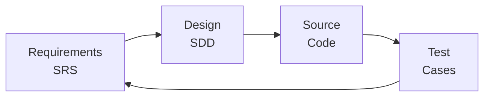

# Requirements Traceability Matrix

## legacy-ddraw-compat: DirectDraw Compatibility Layer

**Document ID:** TM-001
**Version:** 1.0
**Date:** 2026-02-05
**Status:** Approved

---

## 1. Introduction

### 1.1 Purpose

This Requirements Traceability Matrix (RTM) provides bidirectional traceability between:
- Requirements (SRS)
- Design elements (SDD)
- Test cases (Test Plan)
- Source code modules

### 1.2 Traceability Approach

---

## 2. Requirements to Design Traceability

### 2.1 Functional Requirements

| Req ID | Requirement | Design Component | Source Files |
|--------|-------------|------------------|--------------|
| FR-001 | IDirectDraw Interface | DirectDrawImpl | `interfaces/DirectDrawImpl.cpp` |
| FR-002 | IDirectDraw2 Interface | DirectDrawImpl | `interfaces/DirectDrawImpl.cpp` |
| FR-003 | IDirectDraw4 Interface | DirectDrawImpl | `interfaces/DirectDrawImpl.cpp` |
| FR-004 | IDirectDraw7 Interface | DirectDrawImpl | `interfaces/DirectDrawImpl.cpp` |
| FR-010 | Primary Surface Creation | SurfaceManager, SurfaceImpl | `core/SurfaceManager.cpp`, `interfaces/SurfaceImpl.cpp` |
| FR-011 | Off-Screen Surface | SurfaceManager, SurfaceImpl | `core/SurfaceManager.cpp`, `interfaces/SurfaceImpl.cpp` |
| FR-012 | Surface Locking | SurfaceImpl | `interfaces/SurfaceImpl.cpp` |
| FR-013 | Blit Operations | SurfaceManager, SurfaceImpl | `core/SurfaceManager.cpp`, `interfaces/SurfaceImpl.cpp` |
| FR-014 | Flip Operations | SurfaceImpl, DisplayManager | `interfaces/SurfaceImpl.cpp`, `core/DisplayManager.cpp` |
| FR-020 | Palette Creation | PaletteImpl, PaletteManager | `interfaces/PaletteImpl.cpp`, `core/PaletteManager.cpp` |
| FR-021 | Palette Attachment | SurfaceImpl, PaletteManager | `interfaces/SurfaceImpl.cpp`, `core/PaletteManager.cpp` |
| FR-030 | Display Mode Enumeration | DisplayManager | `core/DisplayManager.cpp` |
| FR-031 | Display Mode Setting | DisplayManager | `core/DisplayManager.cpp` |
| FR-032 | Display Mode Restoration | DisplayManager | `core/DisplayManager.cpp` |
| FR-040 | GDI Renderer | GDIRenderer | `renderer/GDIRenderer.cpp` |
| FR-041 | Direct3D 9 Renderer | D3D9Renderer | `renderer/D3D9Renderer.cpp` |
| FR-042 | OpenGL Renderer | OpenGLRenderer | `renderer/OpenGLRenderer.cpp` |
| FR-043 | Auto Renderer Selection | RendererFactory | `renderer/RendererFactory.cpp` |
| FR-050 | INI Configuration | ConfigManager, IniParser | `config/ConfigManager.cpp`, `config/IniParser.cpp` |
| FR-051 | Config Validation | ConfigValidator | `config/ConfigValidator.cpp` |
| FR-052 | Runtime Configuration | ConfigManager | `config/ConfigManager.cpp` |
| FR-060 | File Logging | Logger, LogWriter | `logging/Logger.cpp`, `logging/LogWriter.cpp` |
| FR-061 | Log Rotation | LogWriter | `logging/LogWriter.cpp` |
| FR-062 | Crash Dump Generation | CrashDump | `diagnostics/CrashDump.cpp` |
| FR-070 | Windowed Mode | DisplayManager | `core/DisplayManager.cpp` |
| FR-071 | Borderless Fullscreen | DisplayManager | `core/DisplayManager.cpp` |
| FR-072 | Exclusive Fullscreen | DisplayManager | `core/DisplayManager.cpp` |
| FR-073 | Fullscreen Toggle | DisplayManager, HookManager | `core/DisplayManager.cpp`, `hooks/HookManager.cpp` |

### 2.2 Non-Functional Requirements

| Req ID | Requirement | Design Component | Verification |
|--------|-------------|------------------|--------------|
| NFR-001 | Frame Rate (<5% overhead) | All renderers | Performance test |
| NFR-002 | Input Latency (<1 frame) | DisplayManager, Hooks | Latency test |
| NFR-003 | Memory Usage (<50MB) | All components | Memory profiling |
| NFR-010 | Stability | All components | Integration tests |
| NFR-011 | Graceful Degradation | RendererFactory | Fallback tests |
| NFR-012 | Error Recovery | D3D9Renderer (device lost) | Recovery tests |
| NFR-020 | Windows 7-11 Support | All components | OS compatibility tests |
| NFR-021 | Wine Compatibility | All components | Wine tests |
| NFR-030 | Code Documentation | All source files | Code review |
| NFR-031 | Modular Architecture | Module structure | Architecture review |
| NFR-040 | Unit Testability | Core components | Unit test coverage |

---

## 3. Design to Test Traceability

### 3.1 Component Test Coverage

| Component | Test Suite | Test Cases |
|-----------|-----------|------------|
| DirectDrawFactory | TC-CORE-001 | TC-001-001 to TC-001-005 |
| DirectDrawImpl | TC-CORE-002 | TC-002-001 to TC-002-020 |
| SurfaceImpl | TC-CORE-003 | TC-003-001 to TC-003-025 |
| SurfaceManager | TC-CORE-004 | TC-004-001 to TC-004-015 |
| DisplayManager | TC-CORE-005 | TC-005-001 to TC-005-012 |
| PaletteImpl | TC-CORE-006 | TC-006-001 to TC-006-008 |
| RendererFactory | TC-REND-001 | TC-101-001 to TC-101-005 |
| D3D9Renderer | TC-REND-002 | TC-102-001 to TC-102-010 |
| GDIRenderer | TC-REND-003 | TC-103-001 to TC-103-008 |
| OpenGLRenderer | TC-REND-004 | TC-104-001 to TC-104-008 |
| ConfigManager | TC-CFG-001 | TC-201-001 to TC-201-012 |
| IniParser | TC-CFG-002 | TC-202-001 to TC-202-015 |
| Logger | TC-LOG-001 | TC-301-001 to TC-301-010 |
| IatHook | TC-HOOK-001 | TC-401-001 to TC-401-008 |

### 3.2 Detailed Test Mapping

#### 3.2.1 Surface Operations

| Test ID | Test Case | Requirements | Components |
|---------|-----------|--------------|------------|
| TC-003-001 | Create primary surface | FR-010 | SurfaceImpl, SurfaceManager |
| TC-003-002 | Create with back buffer | FR-010 | SurfaceImpl, SurfaceManager |
| TC-003-003 | Create off-screen surface | FR-011 | SurfaceImpl, SurfaceManager |
| TC-003-004 | Lock entire surface | FR-012 | SurfaceImpl |
| TC-003-005 | Lock partial surface | FR-012 | SurfaceImpl |
| TC-003-006 | Unlock surface | FR-012 | SurfaceImpl |
| TC-003-007 | Blit same size | FR-013 | SurfaceImpl, SurfaceManager |
| TC-003-008 | Blit with stretch | FR-013 | SurfaceImpl, SurfaceManager |
| TC-003-009 | Blit with color key | FR-013 | SurfaceImpl, SurfaceManager |
| TC-003-010 | Blit color fill | FR-013 | SurfaceImpl, SurfaceManager |
| TC-003-011 | BltFast | FR-013 | SurfaceImpl, SurfaceManager |
| TC-003-012 | Flip single buffer | FR-014 | SurfaceImpl, DisplayManager |
| TC-003-013 | Flip double buffer | FR-014 | SurfaceImpl, DisplayManager |
| TC-003-014 | Flip triple buffer | FR-014 | SurfaceImpl, DisplayManager |

#### 3.2.2 Configuration

| Test ID | Test Case | Requirements | Components |
|---------|-----------|--------------|------------|
| TC-202-001 | Parse valid INI | FR-050 | IniParser |
| TC-202-002 | Parse empty file | FR-050 | IniParser |
| TC-202-003 | Parse missing file | FR-050 | IniParser |
| TC-202-004 | Parse with comments | FR-050 | IniParser |
| TC-202-005 | Parse string value | FR-050 | IniParser |
| TC-202-006 | Parse integer value | FR-050 | IniParser |
| TC-202-007 | Parse boolean value | FR-050 | IniParser |
| TC-202-008 | Parse with whitespace | FR-050 | IniParser |
| TC-202-009 | Get nonexistent key | FR-050 | IniParser |
| TC-202-010 | Get nonexistent section | FR-050 | IniParser |
| TC-201-001 | Load valid config | FR-050, FR-051 | ConfigManager |
| TC-201-002 | Validate config values | FR-051 | ConfigManager |
| TC-201-003 | Apply defaults | FR-051 | ConfigManager |
| TC-201-004 | Per-game override | FR-050 | ConfigManager |

---

## 4. Requirements to Test Traceability

### 4.1 Forward Traceability (Req -> Test)

| Req ID | Test Cases | Coverage |
|--------|------------|----------|
| FR-001 | TC-002-001 to TC-002-005 | Full |
| FR-002 | TC-002-006 to TC-002-008 | Full |
| FR-003 | TC-002-009 to TC-002-012 | Full |
| FR-004 | TC-002-013 to TC-002-020 | Full |
| FR-010 | TC-003-001, TC-003-002 | Full |
| FR-011 | TC-003-003 | Full |
| FR-012 | TC-003-004 to TC-003-006 | Full |
| FR-013 | TC-003-007 to TC-003-011 | Full |
| FR-014 | TC-003-012 to TC-003-014 | Full |
| FR-020 | TC-006-001 to TC-006-004 | Full |
| FR-021 | TC-006-005 to TC-006-008 | Full |
| FR-030 | TC-005-001 to TC-005-004 | Full |
| FR-031 | TC-005-005 to TC-005-008 | Full |
| FR-032 | TC-005-009 to TC-005-010 | Full |
| FR-040 | TC-103-001 to TC-103-008 | Full |
| FR-041 | TC-102-001 to TC-102-010 | Full |
| FR-042 | TC-104-001 to TC-104-008 | Full |
| FR-043 | TC-101-001 to TC-101-005 | Full |
| FR-050 | TC-201-001, TC-202-001 to TC-202-010 | Full |
| FR-051 | TC-201-002 to TC-201-003 | Full |
| FR-052 | TC-201-005 | Full |
| FR-060 | TC-301-001 to TC-301-006 | Full |
| FR-061 | TC-301-007 to TC-301-008 | Full |
| FR-062 | TC-301-009 to TC-301-010 | Full |
| FR-070 | TC-005-005 | Full |
| FR-071 | TC-005-006 | Full |
| FR-072 | TC-005-007 | Full |
| FR-073 | TC-005-011 to TC-005-012 | Full |

### 4.2 Backward Traceability (Test -> Req)

| Test Suite | Requirements Covered |
|------------|---------------------|
| TC-CORE-001 | FR-001 |
| TC-CORE-002 | FR-001, FR-002, FR-003, FR-004 |
| TC-CORE-003 | FR-010, FR-011, FR-012, FR-013, FR-014 |
| TC-CORE-004 | FR-010, FR-011, FR-013 |
| TC-CORE-005 | FR-030, FR-031, FR-032, FR-070, FR-071, FR-072, FR-073 |
| TC-CORE-006 | FR-020, FR-021 |
| TC-REND-001 | FR-043 |
| TC-REND-002 | FR-041 |
| TC-REND-003 | FR-040 |
| TC-REND-004 | FR-042 |
| TC-CFG-001 | FR-050, FR-051, FR-052 |
| TC-CFG-002 | FR-050 |
| TC-LOG-001 | FR-060, FR-061, FR-062 |
| TC-HOOK-001 | FR-073 |

---

## 5. Code to Requirements Traceability

### 5.1 Source File Mapping

| Source File | Requirements |
|-------------|--------------|
| `src/core/DllMain.cpp` | NFR-010, NFR-011 |
| `src/core/DirectDrawFactory.cpp` | FR-001 |
| `src/core/SurfaceManager.cpp` | FR-010, FR-011, FR-013 |
| `src/core/DisplayManager.cpp` | FR-030, FR-031, FR-032, FR-070, FR-071, FR-072, FR-073 |
| `src/core/PaletteManager.cpp` | FR-020, FR-021 |
| `src/core/FrameLimiter.cpp` | NFR-001 |
| `src/interfaces/DirectDrawImpl.cpp` | FR-001, FR-002, FR-003, FR-004 |
| `src/interfaces/SurfaceImpl.cpp` | FR-010, FR-011, FR-012, FR-013, FR-014 |
| `src/interfaces/PaletteImpl.cpp` | FR-020, FR-021 |
| `src/interfaces/ClipperImpl.cpp` | FR-001 |
| `src/renderer/RendererFactory.cpp` | FR-043, NFR-011 |
| `src/renderer/D3D9Renderer.cpp` | FR-041, NFR-001, NFR-012 |
| `src/renderer/OpenGLRenderer.cpp` | FR-042, NFR-001 |
| `src/renderer/GDIRenderer.cpp` | FR-040, NFR-011 |
| `src/config/ConfigManager.cpp` | FR-050, FR-051, FR-052 |
| `src/config/IniParser.cpp` | FR-050 |
| `src/config/ConfigValidator.cpp` | FR-051 |
| `src/logging/Logger.cpp` | FR-060 |
| `src/logging/LogWriter.cpp` | FR-060, FR-061 |
| `src/diagnostics/CrashDump.cpp` | FR-062 |
| `src/hooks/IatHook.cpp` | FR-073 |
| `src/hooks/HookManager.cpp` | FR-073 |

---

## 6. Verification Matrix

### 6.1 Verification Methods

| Method | Code | Description |
|--------|------|-------------|
| Unit Test | UT | Automated unit test |
| Integration Test | IT | Multi-component test |
| System Test | ST | Full system test |
| Manual Test | MT | Manual verification |
| Code Review | CR | Review of source code |
| Analysis | AN | Design analysis |

### 6.2 Requirements Verification

| Req ID | UT | IT | ST | MT | CR | AN |
|--------|----|----|----|----|----|----|
| FR-001 | X | X | X | | X | |
| FR-002 | X | X | X | | X | |
| FR-003 | X | X | X | | X | |
| FR-004 | X | X | X | | X | |
| FR-010 | X | X | X | | X | |
| FR-011 | X | X | X | | X | |
| FR-012 | X | X | X | | X | |
| FR-013 | X | X | X | | X | |
| FR-014 | X | X | X | | X | |
| FR-020 | X | X | X | | X | |
| FR-021 | X | X | X | | X | |
| FR-030 | X | X | X | | X | |
| FR-031 | X | X | X | | X | |
| FR-032 | X | X | X | | X | |
| FR-040 | X | X | X | | X | |
| FR-041 | X | X | X | | X | |
| FR-042 | X | X | X | | X | |
| FR-043 | X | X | X | | X | |
| FR-050 | X | X | X | | X | |
| FR-051 | X | | | | X | |
| FR-052 | X | | | | X | |
| FR-060 | X | X | | | X | |
| FR-061 | X | | | | X | |
| FR-062 | | | X | X | X | |
| FR-070 | | X | X | X | | |
| FR-071 | | X | X | X | | |
| FR-072 | | X | X | X | | |
| FR-073 | | X | X | X | | |
| NFR-001 | | | X | | | X |
| NFR-002 | | | X | | | X |
| NFR-003 | | | X | | | X |
| NFR-010 | X | X | X | | X | |
| NFR-011 | X | X | | | | X |
| NFR-012 | X | X | | | | |
| NFR-020 | | | X | | | |
| NFR-021 | | | X | | | |
| NFR-030 | | | | | X | |
| NFR-031 | | | | | | X |
| NFR-040 | X | | | | | X |

---

## 7. Coverage Summary

### 7.1 Requirements Coverage

| Category | Total | Covered | Percentage |
|----------|-------|---------|------------|
| Functional Requirements | 28 | 28 | 100% |
| Non-Functional Requirements | 12 | 12 | 100% |
| **Total** | **40** | **40** | **100%** |

### 7.2 Test Coverage Target

| Type | Target | Current |
|------|--------|---------|
| Unit Tests | 80% code | TBD |
| Integration Tests | All interfaces | TBD |
| System Tests | All use cases | TBD |

---

## Appendix A: Change Log

| Version | Date | Author | Changes |
|---------|------|--------|---------|
| 1.0 | 2026-02-05 | Project Team | Initial release |

---

*End of Document*
